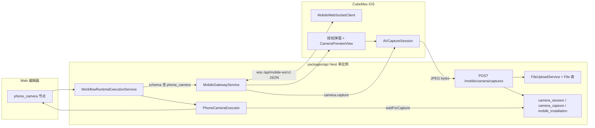
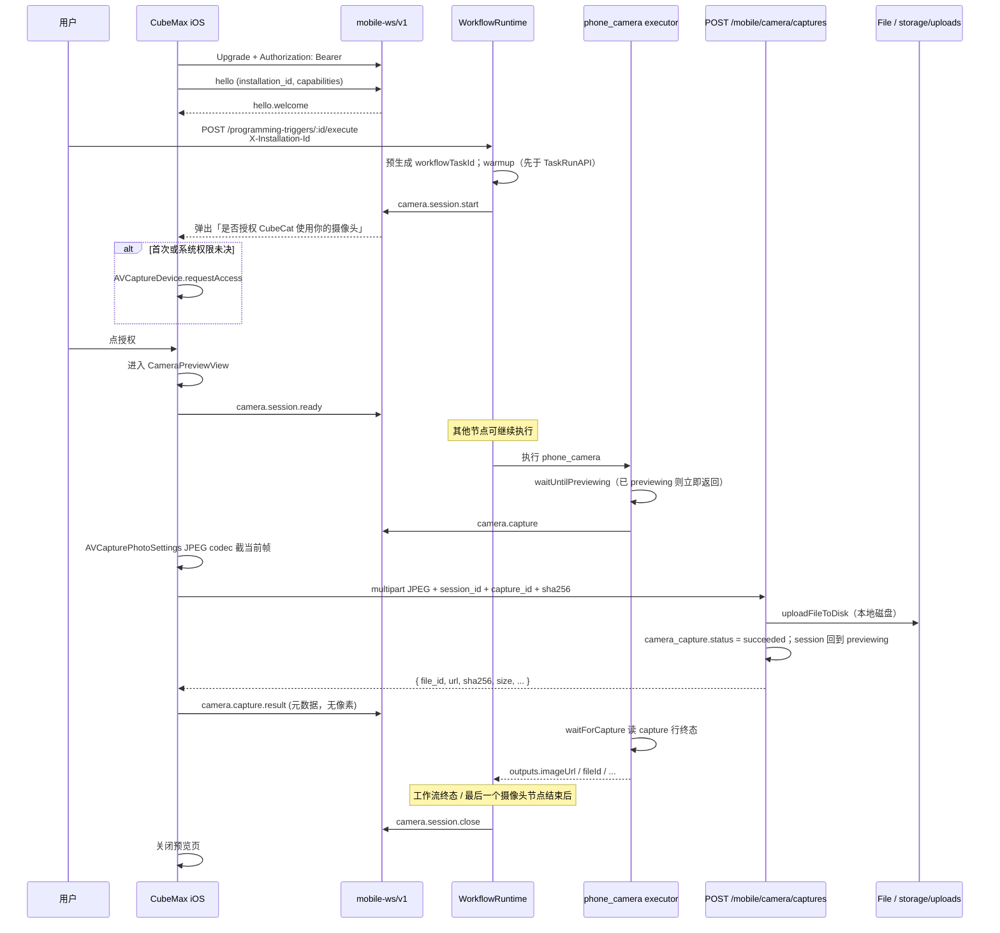
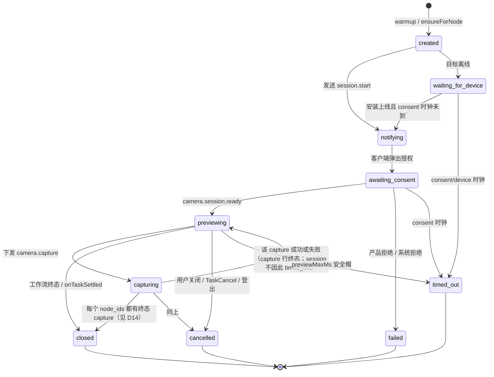
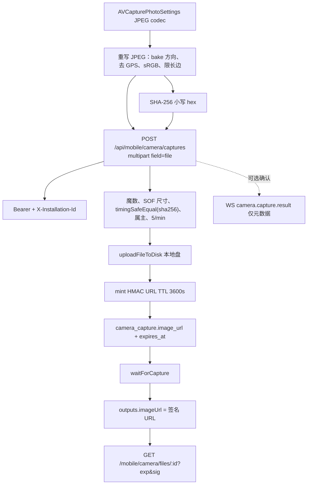

# 手机摄像头工作流节点设计文档

| 字段 | 内容 |
| --- | --- |
| 标题 | CubeMax / CubeCat 手机摄像头节点（`phone_camera`） |
| 作者 | TBD |
| 日期 | 2026-08-22 |
| 状态 | Draft |
| 范围 | v1 静帧拍摄；流式直播只预留协议，不实现 |
| 相关产品请求 | 2026-08-22：全新「调用手机摄像头」节点 |

---

## Overview

CubeMax 应用工作流需要一个**全新**节点：当流程运行到（或因配置在流程启动时预热）该节点时，已登录的 iOS App（`apps/ios/CubeMax`，显示名 CubeMax）弹出产品授权文案「是否授权 CubeCat 使用你的摄像头」。用户授权后进入实时预览页，可切换前置 / 后置摄像头。服务器随后下发拍照指令；App **自动截取当前预览帧**（用户不按快门），把 JPEG 经 HTTP 上传落到现有 `File` 存储，再通过控制面 WebSocket 确认。工作流节点被解除阻塞，向下游输出 **短时 HMAC 签名** `imageUrl`（默认 1 小时 TTL）与 `fileId` 等字段。原始 `/uploads/...` 路径不当节点输出。

当前系统里：

- iOS 只有 HTTP `URLSession`（见 `apps/ios/CubeMax/API.md`），没有 WebSocket、没有摄像头、没有推送。
- 编辑器已有面向 **CubeCat 硬件** 的 `vision` 节点（`packages/client/src/pages/workflows/nodes/vision/`），但运行时 **没有对应 executor**；`WorkflowApplicationExecutorService` 也未挂进 `WorkflowModule`。运行未知节点会在 `WorkflowRuntimeExecutor.execute` 抛出 `No executor found for node type …`。
- 设备通道 `wss://…/api/device-ws/v1`（`LuaDeviceGatewayService`）按 Board UUID 自动登记、**无 JWT**、明文 JSON 上限 24 576 字节、**禁止 Binary Frame**，无法承载 JPEG。

因此 v1 采用：**独立的用户鉴权 Mobile WebSocket 控制面 + 现有文件上传数据面**。静帧走 HTTP multipart；控制指令走与 ESP32 同构的 JSON 信封（Close Code **不以** Lua 实现或 ESP32 文档为准，见 **D2** 与 §C）。后续「流式直播」通过保留的 `camera.stream.*` 与 `transport` 枚举扩展，不改静帧契约。

**任务关联键**：HTTP `taskID`、`context.metadata.workflowTaskId`、`camera_session.workflow_task_id` 必须是**同一个** UUID。它 **不是** `WorkflowRuntimeContext.id`。实现上要改 `WorkflowRuntimeEngine.invoke`，在 `process()` 之前分配 `taskId`（见 §7.3）。

---

## Background & Motivation

### 现状

| 层 | 现状 | 关键路径 |
| --- | --- | --- |
| iOS App | 登录（`terminal: 4` = `UserTerminal.APP`）、触发器、对话、Home Assistant 家居、方糖猫资产页。无相机、无 WS、无 APNs | `apps/ios/CubeMax/CubeMax/` |
| 触发器执行 | `POST /programming-triggers/:id/execute` → `WorkflowRuntimeExecutionService.runPublishedProject` → 内存任务 `WorkflowApplication.tasks`，立即返回 `{ taskID }` | `programming-trigger.service.ts`、`workflow-runtime-execution.service.ts` |
| 工作流运行时 | `@flowgram.ai/runtime-js` 按节点 `type` 找 executor；已注册 `start/end/llm/mcp/http/code/lua/…`。Lua 通过 `registerLuaExecutor` 把执行委托给 Nest | `packages/@flowgram.ai/runtime-js/src/nodes/index.ts` |
| 应用节点 | 编辑器有 `agent` / `wait` / `webhook` / `vision` / `speech` / `device_control`。`WorkflowApplicationExecutorService` 是**死代码**：未列入 `WorkflowModule.providers`，也从未被 `TaskValidateAPI` / 发布路径调用。不要在里面加校验并指望它会跑 | `workflow-application-executor.service.ts` |
| ESP32 通道 | 原生 `ws`，路径 `/api/device-ws/v1`，信封 `{ v, type, id, ts, data, reply_to? }`，snake_case | `docs/esp32-lua-websocket-protocol.md`、`lua-device-gateway.service.ts` |
| 文件上传 | `POST /upload/file`，`multipart/form-data` 字段 `file`，返回 `{ id, url, originalName, size, mimeType, extension }`，落盘 `storage/uploads/{type}/{year}/{month}/{uuid}.ext` | `upload.controller.ts`、`FileUploadService`、`File` 实体 |
| JSON Body 上限 | `packages/api/src/main.ts` 中 `bodyParser.json({ limit: "5mb" })`；Multer 使用 `memoryStorage()`，**未设 fileSize** | 拍照接口必须自设上限 |

### 痛点

1. 课堂 / 应用工作流需要「看一眼现实世界」的输入，但现有 `vision` 绑定的是 CubeCat `deviceId` 和「拍摄 + AI 分析」，不是手机摄像头。
2. 用户已经在 iOS 上跑触发器（`TriggerFormView` → `executeTrigger`），手机就是最自然的摄像头。
3. ESP32 通道不能复用：无用户身份、消息太小、升级处理会 `socket.destroy()` 掉非 `/api/device-ws/v1` 的 Upgrade（见下方风险）。
4. 产品明确要求：**服务器发拍照指令才截帧**（不是用户按快门），并写清图片如何回到服务器，同时不堵死以后的直播。

---

## Goals & Non-Goals

### Goals

1. 新增工作流节点类型 `phone_camera`（中文名「手机摄像头」），出现在 **应用工程**（`projectType === "application"`）的「智能交互」分组。
2. 默认在工作流启动时向目标 iOS 下发 `camera.session.start`（`openCameraOn=workflow_start`）。若节点全部为 `node_enter`，则等到该节点执行才弹授权。授权后进入预览，可切换前后摄像头。
3. 节点真正执行时：服务器下发 `camera.capture`；App 自动截取当前预览、编码 JPEG、HTTP 上传、回传元数据；节点输出图片给下游。
4. 同时覆盖 **iOS 系统相机权限**（`NSCameraUsageDescription` + `AVCaptureDevice.requestAccess`）和 **产品内授权**（上述中文文案）。两者缺一不可。
5. 文档化完整回传路径：编码、大小、鉴权、存储、节点如何解除阻塞。
6. 协议面向消息、可扩展 `camera.stream.*`，v1 拒绝直播能力。
7. 明确失败路径：拒绝授权、App 进后台、超时、无在线手机、多设备、工作流取消、拍摄/上传失败、登出/令牌撤销。
8. v1 **禁止** `phone_camera` 出现在 `loop` 的 `blocks` 内（编辑器 + 运行时双重校验）。

### Non-Goals（v1 不做）

- 不实现直播 / WebRTC / MJPEG 推流。
- 不在本节点内做 AI 视觉分析（那是未完成的 `vision` 节点职责；可在下游用 LLM / HTTP）。
- 不把 JPEG 塞进 WebSocket JSON 或 Binary Frame。
- 不实现 APNs 唤醒（v1 要求 App 前台且 WS 已连接；协议预留 `push_token`）。
- 不复用、不修改 `vision` 节点语义；不把手机登记进 `lua_physical_device`。
- **不支持 Android**（产品已拍板，除非另开需求）。hello 的 `platform` 在 v1 **只接受字面量 `"ios"`**，不为 Android 排期。
- 不在后台采集摄像头（iOS 不允许；进后台即暂停预览并上报）。
- 不把照片写入用户相册（除非后续另开需求）。
- 不解决多 API 进程持有不同 socket 的生产级路由（与 ESP32 文档第 11 节相同：v1 单实例内存注册表）。
- 不把 `phone_camera` 放进循环节点；不在循环迭代上复用同一个 `node.id` 拍多张。
- 摄像头照片 v1 **只走本地磁盘** `FileUploadService.uploadFileToDisk`。OSS/COS **不在本设计范围**。
- 不跨用户拍摄：老师跑工程不会拍到学生手机。
- 不把公开 `/uploads/**` 路径作为节点 `imageUrl`（v1 用短时签名下载）。

---

## Key Decisions

| # | 决策 | 理由 |
| --- | --- | --- |
| D1 | 新节点类型 `phone_camera`，**不复用** `vision` | `vision` 面向 CubeCat `deviceId` + AI 分析，且 runtime 未实现；产品要求「全新节点」。 |
| D2 | 独立网关 `wss://{host}/api/mobile-ws/v1`，**不复用** `/api/device-ws/v1` | ESP32 无 JWT、24 KB 上限、禁止 binary、按 Board UUID 自动登记。手机是用户绑定安装。信封字段名对齐 ESP32；**Close Code 用本协议 44xx 表，不复制 Lua 的 4000/文档 4002**。 |
| D3 | 控制面：UTF-8 JSON 文本帧，信封 `{ v, type, id, ts, data, reply_to? }`，snake_case。数据面：HTTP multipart 上传 JPEG | 静帧 200 KB–2 MB，塞进 WS JSON 会撑爆现有网关惯例；HTTP 可复用 `FileUploadService` + `File` 表。 |
| D4 | **专用** `POST /api/mobile/camera/captures` 作为像素权威入口；v1 **只写本地磁盘** `uploadFileToDisk`。节点 `imageUrl` 是 **HMAC 签名短时 URL**（默认 TTL **3600 s**），不是公开 `/uploads/...`。下载走 `GET /api/mobile/camera/files/:fileId?exp=&sig=`，过期可删盘 | 下游 LLM/HTTP 在服务端跑，不能带用户 JWT；公开静态路径可被猜。OSS 不在范围 |
| D5 | 节点解除阻塞以 **HTTP 上传成功并写入 `camera_capture.status = succeeded`** 为准；同时 **铸造** 签名 `imageUrl`。WS `camera.capture.result` 是幂等确认 | 上传完成后 WS 可能断；`waitForCapture` 只读 **capture 行** |
| D6 | 默认 `openCameraOn=workflow_start`：warmup 落库 `node_ids` **并**发 `camera.session.start`。若 schema 内**全部**摄像头节点都是 `node_enter`，warmup **只**持久化 session/`node_ids`，**不**发 start；由该节点 `ensureForNode` 打开预览。混合图：只要有一个 `workflow_start`（缺省），启动时共用一次预览。**`execute` 在 `requestCapture` 之前必须 `waitUntilPreviewing`**：status 进入 `previewing` 后才允许 `camera.capture`；`captureDelayMs` 从 ready 起算。禁止在 `created\|notifying\|awaiting_consent\|waiting_for_device` 下发拍照 | 产品默认「流程启动即授权」。`node_enter` 与 `start → phone_camera` 都会在用户还在弹窗时撞上 executor；capture 时钟（30 s）短于 consent（60 s） |
| D7 | **目标设备必须在工作流里提前选定**，禁止运行时「谁在线拍谁」。`deviceBinding`：`triggering_device`（本 run 由 CubeMax 带 `X-Installation-Id` 启动时用这台手机）或 `specific`（编辑器下拉安装 UUID）。**删除 `user_online`**。缺头或 Web 试运行未选 `specific` → `CAMERA_NO_TARGET_DEVICE`。v1 只拍 **执行用户自己的** 安装，不跨用户拍学生机。允许 **并行** `phone_camera`：同一 `installation_id` 共用一个预览、capture 串行；**不同安装（同一用户两台手机）各开 session，真正并行** | 用户拍板：「提前设置好目标拍摄设备，但是允许并行」 |
| D8 | 向 AVFoundation **直接请求 JPEG codec**；HEIC→JPEG 仅作无 JPEG 编码器时的 fallback。去 GPS；长边默认 ≤ 1920；质量默认 0.8；最大 2 097 152 字节 | 现代 iPhone 默认 `fileDataRepresentation()` 是 HEIC。2 MB 是本协议显式上限（仓库里 2 MB 出现在组织子账号 CSV 导入，**不是**头像；不要拿头像类比）。 |
| D9 | 运行时 `registerPhoneCameraExecutor`；`waitForCapture` 以 DB 轮询 250 ms 为主，同进程可用 `EventEmitter` 加速唤醒 | 对齐 `waitForRun`。40 人课堂 × 120 s / 0.25 s ≈ 每 waiter 480 次 poll，单实例可接受。EventEmitter 不是正确性条件。 |
| D10 | v1 要求 App 前台 + WS 在线。登出 / 令牌撤销必须拆掉 socket（4403） | 没有 APNs；Upgrade 时 JWT 只验一次，不拆线等于撤销后仍能收 `camera.capture`。 |
| D11 | 直播只预留。v1 hello **冻结** `capabilities: ["camera.photo"]`，禁止「顺便」声明 `camera.stream`。未知 `type` → `UNSUPPORTED_MESSAGE`；已知保留的 `camera.stream.*` / `camera.webrtc.*` → `UNSUPPORTED_CAPABILITY` | 静帧 `transport: "http_upload"`；binary 直播必须新 path / v2。 |
| D12 | 引入共享 `HttpUpgradeRouter`：Lua 与 Mobile 按 path 注册。URL 解析失败仍 `destroy`；**无匹配 handler 也 `destroy`**，避免探针悬挂 | 仅把 Lua 的 mismatch 改成 `return` 会让未知 Upgrade 挂到客户端超时。 |
| D13 | **关联 ID**：`invoke` 在 `process()` 之前分配 `taskId`，写入 `context.metadata.workflowTaskId`，并以该值构造 `WorkflowRuntimeTask.id`。Nest 可预先生成同一 UUID 并在 `TaskRunAPI` **之前** warmup。禁止使用 `context.id`。PR 4a **导出** `onTaskSettled(taskID, cb)`，**不**导出 `WorkflowApplication` 单例 | 今日 `task.id` 与 `context.id` 是两次 `uuid()`；`WorkflowApplication` 不在 `runtime-js` 的 public export 上，Nest 不能去 `.tasks.get` |
| D14 | **Session 与 Capture 分生命周期**。Session 无 `succeeded`。一 task **每个目标 installation 一个 session**（UNIQUE `(workflow_task_id, installation_id)` 活跃行）。Executor `finally` 对该 **session** 的 `node_ids` 做 `closeWhenAllNodeCapturesTerminal`；`onTaskSettled` 关闭该 task 下全部 session | 两台手机并行时关 A 不能把 B 的预览拆掉。同机并行节点共享预览、不要开两个 `CameraPreviewView` |
| D15 | v1 **禁止** `phone_camera` 位于 `loop` 内 | `canContainNode` 当前对非 start/end 一律放行；同一 `node.id` 无法表达第 N 次迭代。 |
| D16 | 手机摄像头**默认启用**，不使用 `MOBILE_CAMERA_ENABLED` 环境变量。`GET /api/mobile/config` 固定返回 `{ cameraEnabled: true }`。应用工程节点库始终展示 `phone_camera` | 该开关已去掉；旧 App 对未知 `camera.*` 仍回 `UNSUPPORTED_MESSAGE` |

---

## Proposed Design

### 1. 总体架构



职责划分：

- **浏览器**：继续只走 HTTP（编辑、试运行、查 `taskID` report）。不直连手机。
- **Nest API**：JWT 鉴权、安装登记、会话状态机、拍照指令、落盘、阻塞工作流节点。
- **iOS**：登录后维持 Mobile WS；处理授权与预览；收到 `camera.capture` 后截帧并 HTTP 上传。

### 2. 与现有组件的关系

```text
不要做的事:
  - 不要往 LuaPhysicalDevice / /api/device-ws/v1 登记 iPhone
  - 不要复用 vision 节点的 deviceId / analysisPrompt
  - 不要把 JPEG base64 放进 camera.capture.result
  - 不要把 JWT 放进 WebSocket URL query（会进日志 / 代理 access log）

要对齐的事:
  - 信封字段名与 ESP32 相同，便于解析器拷贝；**不要**拷贝 `LuaDeviceGatewayService.handleDeviceMessage` 或 Close Code
  - 上传结果形状对齐 `UploadFileResult`，但对外契约是 `/mobile/camera/captures`
  - 工作流输出用 **短时 HMAC 签名** 绝对 URL 的 `imageUrl`（下游 LLM 可在 TTL 内无用户 JWT 拉取）
  - 登录继续 terminal: 4，Authorization: Bearer，x-organization-id
```

### 3. 端到端时序（主路径）

产品要求：流程**启动**即授权并进入预览；**稍后**服务器发拍照指令。



从 Web 点「试运行」时：节点必须是 `specific`（已选安装）或 run 自带 `X-Installation-Id`（`triggering_device`）。**禁止**静默挑一台在线手机。试运行面板显示「用 CubeMax 连接」：目标手机须已登录且 App 在前台。目标离线则 `waiting_for_device` 直到 **consent/device 时钟**（默认 60 s）。

**并行**：同一 `installation_id` 的多个 `phone_camera` 共用一个 session / 一个预览，capture 串行。不同 `installation_id`（同一用户两台 iPhone）warmup 建 **多个** session，各连各的 WS，真正并行。一台物理手机只打开一个 `CameraPreviewView`。

### 4. 会话与拍摄状态机（必须分开）

**Session 没有 `succeeded`。** 一次工作流 run 共用一个预览会话；每张照片是 `camera_capture` 子行。



Capture 行（`camera_capture`，v1 必建）：

```text
pending → uploading → succeeded | failed
```

`waitForCapture` 与节点 `outputs` **只读 capture 行**。HTTP 处理步骤更新 capture 行，并把 session 从 `capturing` **拉回 `previewing`**。HTTP **不**关 session。谁关预览见 D14：executor `finally` 仅当 `node_ids` 全部有终态 capture；否则 `onTaskSettled` → `closeByTaskId`。

**Capture 时钟从不把 session 标 `timed_out`。** 图中没有 `capturing --> timed_out`。

同一 `workflow_task_id` 共用预览；每个 **节点执行** 一次 `camera.capture`（新 `capture_id`，不是「每个 node.id 一辈子一次」——但 v1 禁止 loop，所以实际上每个 node.id 每 run 一次）。

单张失败：该节点 throw；session **不**因此 close，除非引擎随后把整个 workflow 标失败（`onTaskSettled` → `closeByTaskId`）。并行两个 `phone_camera`：同一 session 上 **串行** capture（第二个 `requestCapture` 等到 session 回到 `previewing`）。

#### 三套时钟

| 时钟 | 起点 | 默认 | 超时效果 |
| --- | --- | --- | --- |
| **Consent / device-online** `consentTimeoutMs` | **实际发出** `session.start` 之时（`workflow_start` = warmup；纯 `node_enter` = 该节点 `ensureForNode`） | **60 000 ms**（10–120 s） | session `timed_out`；尚未 `ready` 则后续节点失败 `CAMERA_DEVICE_OFFLINE` / 未授权 |
| **Preview idle** `previewMaxMs` | 进入 `previewing` | **600 000 ms**（10 分钟安全帽）；`0` = 只随工作流结束 | session `timed_out` 并 `session.close`。上游 LLM/Lua 可以合法超过 60 s，只要已经 `ready` |
| **Capture** 节点字段 `timeoutMs` | 该次 `camera.capture` 发出 | **30 000 ms**（5–120 s） | 该 `camera_capture` → `failed` `CAPTURE_TIMEOUT`；节点 throw。session 回到 `previewing` 或随工作流 close |

编辑器文案必须写明：`timeoutMs` =「拍照指令到上传成功」，**不是**「从打开相机到流程结束」。`consentTimeoutMs` =「弹出授权后多久必须点允许并出预览」。

**多节点时钟（一 session）**：warmup 取 schema 内全部 `phone_camera` 的 **`max(consentTimeoutMs)`** 与 **`max(previewMaxMs)`**（缺省用节点默认值）。各节点自己的 `timeoutMs` 只约束该次 capture。不按「第一个节点」或「最小值」取 consent/preview，避免短时钟饿死后面的节点。

### 5. iOS 客户端设计

#### 5.1 现状约束

- 工程：`apps/ios/CubeMax/project.yml`，bundle `com.cubemax.mobile`，iOS 17+，Swift 6，`GENERATE_INFOPLIST_FILE: true`。
- 网络：`APIClient` actor + `URLSession`；生产 `https://max.sh.creativone.cn/api`；`Authorization: Bearer`；组织头 `x-organization-id`。
- 登录：`POST /auth/login` `{ username, password, terminal: 4 }`。
- 密钥：`KeychainStore` service `com.cubemax.mobile`，account `access-token`。
- UI：SwiftUI，`.tint(.indigo)`，`Color(uiColor: .systemGroupedBackground)`，圆角 16 continuous；全屏错误用 `ErrorBanner`。
- **没有** `Info.plist` 相机文案，没有 `AVFoundation`，没有 `URLSessionWebSocketTask`。

#### 5.2 新增文件（建议）

```text
apps/ios/CubeMax/CubeMax/
  Features/Camera/
    CameraConsentView.swift      # 产品授权弹窗
    CameraPreviewView.swift      # 全屏预览 + 切换镜头 + 状态条
  Services/
    MobileWebSocketClient.swift  # 长连接、心跳、分发 camera.*
    CameraSessionController.swift# AVCaptureSession 串行队列
    CameraCaptureUploader.swift  # multipart 上传
  Models/
    MobileProtocol.swift         # 信封与消息 Codable
```

`AppModel` 持有 `MobileWebSocketClient`；`RootView` 用 `.fullScreenCover` 呈现摄像头页，避免依赖当前 Tab / Sheet。

#### 5.3 安装身份

首次启动在 Keychain 写入 `installation-id`（小写 UUID v4），与 token 分 account 存储，**登出不删除**（物理手机身份）。之后：

- 所有 HTTP 请求增加头 `X-Installation-Id: <uuid>`。
- WebSocket hello 的 `data.installation_id` 必须与该值相同。
- 触发器执行时服务端把该头写入 runtime `context.installationId`。

**表约束是 UNIQUE `(user_id, installation_id)`，不是全局 UNIQUE `installation_id`。** Hello **按 `(user_id, installation_id)` upsert**，**禁止** `UPDATE user_id` 把一行改成另一个用户。

算法（每次 hello）：

1. 查找其它 user 的同行：`installation_id = uuid AND user_id <> currentUser AND superseded_at IS NULL`。若有：将这些行设 `superseded_at = now()`，并把这些 user 名下该安装的非终态 session `close`（reason `installation_rebound`）。
2. Upsert **当前** `(currentUser, uuid)`：行已存在（含 `superseded_at` 非空，例如 A→B 之后 A 再登录）则 **clear `superseded_at`**、刷新 `last_seen_at` / capabilities，**不要 INSERT**（否则撞 UNIQUE）。不存在则 INSERT。
3. 若步骤 1 关掉了 B 的 in-flight session，B 侧收到 `session.close`。

例：A hello → `(A, uuid)`；A 登出关 WS；B hello 同 uuid → 超 A 的行、INSERT `(B, uuid)`；A 再登录 hello → 超 B 的行、**复活** `(A, uuid)`（clear `superseded_at`），不插第三行。

卸载重装会生成新 UUID（旧行靠 `last_seen_at` 清理）。

#### 5.4 双重授权（必须分开实现）

**A. 产品授权（CubeCat 文案）**

触发：收到 `camera.session.start`。

弹窗（`.alert` 或独立 sheet）。**标题在 App 内写死**，不渲染服务端任意字符串：

```swift
static let productConsentTitle = "是否授权 CubeCat 使用你的摄像头"
```

- 标题：上述常量。
- 正文：`工作流「{session.title}」需要拍摄一张照片并发送到 CubeMax 服务器，供后续节点使用。你可以随时拒绝。`（`title` 截断 40 字，来自服务器触发器/工程名，按纯文本显示）。
- 按钮：`拒绝` / `授权`

`camera.session.start.data.consent_prompt` 仍下发，仅用于服务端审计 / 未来文案实验。客户端：**仅当该字段与 `productConsentTitle` 完全相等时才用它；否则忽略，始终显示常量。** 防止 API 被改写权限文案。

**不要**写 `UserDefaults` 记住产品授权。**每个摄像头 session 都弹**产品文案「是否授权 CubeCat 使用你的摄像头」。不记住 30 天。iOS 系统相机权限仍走 `requestAccess`，系统只问一次。

- 授权 → 继续系统权限流程。
- 拒绝 → 发 `camera.session.rejected`，`reason: "product_consent_denied"`，不申请系统权限。

**B. iOS 系统权限**

`project.yml` 增加：

```yaml
INFOPLIST_KEY_NSCameraUsageDescription: "CubeCat 需要使用摄像头，以便工作流拍摄照片并发送到服务器。"
```

产品授权成功后：

```swift
let granted = await AVCaptureDevice.requestAccess(for: .video)
```

- 已授权：进入预览。
- 拒绝 / 受限：发 `camera.session.rejected`，`reason: "system_permission_denied"`，UI 提示去系统设置。
- 未决定：系统对话框（文案来自 Info.plist，**不能**改成产品那句；两套文案共存是预期）。

#### 5.5 摄像头页面 UX

全屏 `CameraPreviewView`，忽略 safe area 的预览层，控件叠在上面。

| 元素 | 行为 |
| --- | --- |
| `AVCaptureVideoPreviewLayer` | `videoGravity = .resizeAspectFill` |
| 左上「关闭」 | 发 `camera.session.cancel`，reason `user_closed`；结束工作流摄像头会话 |
| 右上状态胶囊 | `等待拍照指令` / `正在拍照` / `正在上传` / `已完成` / `失败` |
| 右下切换按钮 | `arrow.triangle.2.circlepath`，切换 front/back；切换期间禁用拍照 |
| **无快门按钮** | v1 拍摄仅由服务器触发，避免用户以为要点拍照 |

`CameraSessionController` 在专用 `DispatchQueue(label: "com.cubemax.camera.session")` 上配置 `AVCaptureSession`（Apple 推荐，避免阻塞主线程）。`AVCapturePhotoOutput` 用于静帧。

切换镜头：

1. `session.beginConfiguration()`
2. 移除旧 `AVCaptureDeviceInput`
3. `AVCaptureDevice.default(.builtInWideAngleCamera, for: .video, position:)`
4. `commitConfiguration()`
5. 可选：发 `camera.session.state` `{ facing, preview: true }`（不要求服务端 ACK）

默认 facing 来自 `camera.session.start.data.facing_default`（`front` | `back`，默认 `back`）。`allow_switch_facing == false` 时隐藏切换按钮。

#### 5.6 收到 `camera.capture`

1. 校验 `session_id`、`capture_id` 与当前页一致；否则回 `error` `CAPTURE_SESSION_MISMATCH`。
2. 状态胶囊改为「正在拍照」。
3. **Happy path：向 AVFoundation 直接要 JPEG**（不要默认 HEIC 再转）：

```swift
photoOutput.isHighResolutionCaptureEnabled = true
if #available(iOS 16.0, *) {
    // location 嵌入关掉（iOS 16+ photoOutput.maxPhotoDimensions 等按机型设置）
}
let settings = AVCapturePhotoSettings(format: [AVVideoCodecKey: AVVideoCodecType.jpeg])
settings.flashMode = .off
if photoOutput.isHighResolutionCaptureEnabled {
    settings.isHighResolutionPhotoEnabled = true
}
photoOutput.capturePhoto(with: settings, delegate: self)
```

4. `fileDataRepresentation()` 得到的应是 JPEG。若 codec 不可用（模拟器 / 极端机型）才 fallback：`UIImage` + `jpegData(compressionQuality:)`，并打日志 `heic_fallback`。
5. 用 `CGImageDestination` **重写**一份 JPEG：bake orientation 到像素；**不拷贝** `{GPS}` / location metadata；颜色空间 sRGB（`kCGImageDestinationLossyCompressionQuality` 用指令质量）。不要声称「保留原 EXIF 只删 GPS」却走 `UIImage.jpegData` 这一套。
6. 若长边 > `max_edge_px`（默认 1920），按比例缩小后再压 JPEG。
7. `jpeg_quality` 0.50–0.95，默认 0.80。
8. 若体积 > `max_bytes`（默认 2 097 152），降质量一步（最低 0.50）再试；仍超则 `CAPTURE_TOO_LARGE`。
9. SHA-256（最终上传字节，小写 hex 64）。
10. 状态「正在上传」→ `CameraCaptureUploader`。
11. 成功后发 `camera.capture.result`（无像素）。
12. 等待 `camera.session.close` 或下一次 capture。WS 在无 `close` 的情况下断开：grace 2 s 后 dismiss 预览并展示失败（避免节点 throw 后用户一直停在相机页）。

并发：同一 session 同时只处理一个 `capture_id`。重复指令若该 capture 已 succeeded，重放 HTTP（幂等）并重发 result。

#### 5.7 WebSocket 客户端

登录成功 / `restoreSession` 成功后连接：

```text
wss://max.sh.creativone.cn/api/mobile-ws/v1
```

由 `APIClient.baseURL` 推导：`https://host/api` → `wss://host/api/mobile-ws/v1`；`http://127.0.0.1:4090/api` → `ws://127.0.0.1:4090/api/mobile-ws/v1`。

**ATS**：`project.yml` **不加**全量 ATS 例外。真机访问明文 `ws://` 局域网会被拒绝，与现有 `API.md`「真机请用局域网 HTTPS」一致。开发选项：

- 推荐：局域网 HTTPS（mkcert / 现有生产证书域名），WS 自动变 `wss://`。
- 模拟器：`ws://127.0.0.1:4090` 通常可用。
- 若必须给 Debug 开 localhost 例外，只用 Debug xcconfig 的 `NSAppTransportSecurity` / `NSExceptionDomains` 指向 `127.0.0.1` 与 `localhost`，**不要**打进 Release。

**不要**对任意用户输入的 host 强制 https 升级；沿用 `APIEndpoint.normalizedURL` 对生产 host 的现有规则。

Upgrade 请求头：

```http
Authorization: Bearer <token>
x-organization-id: <optional>
X-Installation-Id: <uuid>
```

使用 `URLSessionWebSocketTask(with: request)`。hello 必须在 **10 秒内**发出。hello `capabilities` **冻结为** `["camera.photo"]`（PR 6/7 禁止「为未来」附带 `camera.stream`）。

两套保活，不要混为一谈：

| 机制 | 行为 | 依据 |
| --- | --- | --- |
| RFC 6455 Ping | 服务端每 **25 s** `ping()`；若上一轮 `alive==false`（没收到 Pong）则 `terminate()`。这是 `LuaDeviceGatewayService.heartbeat` 的**真实代码**，约 25–50 s 无 Pong 掉线。本网关复制该实现。 | Lua **代码**，不是 ESP32 文档里的「10 s pong / 45 s 无 device.status」 |
| 应用心跳 `device.status` | 客户端每 20 s 以及 `app_state` / 预览变化时发送。服务端用来更新 `last_seen_at` 与前台状态，**不**替代 RFC ping。消息名仅为解析器方便；**不要**复用 `handleDeviceMessage` | 新 `MobileGatewayService` |

断线退避：1、2、4、8、16、30 秒，封顶 30 秒。

**清 token 回登录页**的条件：HTTP 401，或 WS close **4403**（unauthorized / 令牌撤销）。没有 4003。

未知 `type`：回 `error.code = UNSUPPORTED_MESSAGE`，`retryable: false`，**不断开**。保留的直播类型：`UNSUPPORTED_CAPABILITY`。

前台：`scenePhase == .active` 时确保连接。后台：暂停 `AVCaptureSession`、发 `camera.session.state` `{ app_state: "background" }`，建议 5 秒后主动 close。回到前台重连；若服务端 session 仍 `previewing`，恢复预览并再发 `camera.session.ready`。

**登出**：`AppModel.logout` 在 `POST /auth/logout` 与清 Keychain **之前**必须 `mobileSocket.close(4403)`（或 1000）。`installation-id` 保留。令牌被服务端撤销时（见 §6.4）也会收到 4403，同样回登录页。

#### 5.8 触发器页改动

`TriggerFormView.submit` 在 `executeTrigger` **之前**必须已建立 WS（`AppModel.ensureMobileSocket()`）。若连接失败，显示「无法连接实时通道，无法使用摄像头节点」，不要只丢一个 `taskID` 让用户以为成功。

执行成功后不要立刻 dismiss：摄像头页由 `RootView` 覆盖。无摄像头节点的工程保持现状（展示 `taskID` 成功条）。

手机摄像头默认启用。**未含相机代码的旧 App**：对未知 `type` 只回 `UNSUPPORTED_MESSAGE`、保持连接。

### 6. 服务端网关

新模块 `packages/api/src/modules/mobile/`：

```text
mobile.module.ts
mobile-gateway.service.ts      # WebSocket（独立实现，不复用 Lua handleDeviceMessage）
mobile-protocol.ts             # 信封校验
mobile.controller.ts           # HTTP：captures、installations
mobile.dto.ts
camera-session.service.ts      # session/capture 状态机 + waitForCapture
```

共享 Upgrade：`packages/api/src/common/ws/http-upgrade-router.ts`。

#### 6.0 Nest 模块图（禁止循环）

`AuthModule` **不是** `@Global()`。`FileUploadService` 在 `packages/core/src/modules/upload/upload.module.ts` 的 `UploadModule`（core，下文称 `CoreUploadModule`），也不是 global。

```text
AppModule
  ├─ AuthModule
  ├─ WsUpgradeModule          // packages/api/src/common/ws/ws-upgrade.module.ts
  │     providers/exports: HttpUpgradeRouter
  │     被 LuaDeviceModule 与 MobileModule **同时 import**
  │     （Nest 共享同一 provider 实例；不要 @Global 也行，但必须两边都 import，
  │      否则 Lua 仍自己 httpServer.on("upgrade")）
  ├─ LuaDeviceModule
  │     imports: TypeOrm…, WsUpgradeModule
  │     onApplicationBootstrap: router.register(devicePath, luaHandler)
  ├─ MobileModule
  │     imports: AuthModule, CoreUploadModule, WsUpgradeModule,
  │              TypeOrmModule.forFeature([MobileInstallation, MobileConnection,
  │                                        CameraSession, CameraCapture])
  │     exports: CameraSessionService, MobileGatewayService
  │     onApplicationBootstrap: router.register(mobilePath, mobileHandler)
  └─ WorkflowModule
        imports: LuaDeviceModule, MobileModule, …   // 单向；Mobile 不得 import Workflow
```

`HttpUpgradeRouter.register(path, handler)` **幂等**；**第一次** `register` 时才 `httpServer.on("upgrade")`，避免 bootstrap 顺序导致「router 还没挂 listener」。Lua / Mobile **不再**自己 `httpServer.on("upgrade")`。

手机摄像头默认启用，不再读取环境变量。`GET /mobile/config` 固定返回 `{ cameraEnabled: true }`。

HTTP 控制器：

```ts
@WebController("mobile")          // 路径不得含 "/"，validatePath 会抛
export class MobileController {
  @Get("config")
  async config() {
    return { cameraEnabled: true };
  }

  @Post("camera/captures")
  @UseInterceptors(FileInterceptor("file", { limits: { fileSize: 2_097_152 } }))
  async capture(...) {}

  @Get("installations")
  async list(...) {}

  @Get("camera/files/:fileId")
  @Public()
  async downloadSigned(...) {}
}
```

即对外 `POST /api/mobile/camera/captures`。全局 `MulterModule.register({ storage: memoryStorage() })` **没有** fileSize，必须写在 `FileInterceptor` 上。

#### 6.1 Upgrade 路由（PR 1 必做，含 Lua 冒烟）

今日 Lua：

```250:268:packages/api/src/modules/lua-device/lua-device-gateway.service.ts
        if (pathname !== this.websocketPath) {
            socket.destroy();
            return;
        }
```

Node `http.Server` 的 `'upgrade'` 会通知**所有** listener。Lua 由 `AppModule → LuaDeviceModule` 先注册，会先杀掉 `/api/mobile-ws/v1`。

**不要**只改成 mismatch `return`：URL 解析失败仍应 `destroy`；**谁都不匹配的 path** 若无人 `handleUpgrade`，socket 会挂到客户端超时。

引入 `HttpUpgradeRouter`（单例）。**唯一挂 listener 的规则**（与 §6.0、PR 1 相同，禁止再写一份 `onApplicationBootstrap` 去 `httpServer.on("upgrade")`，否则 Node 会把同一 Upgrade 交给两个 listener）：

- Lua / Mobile 的 `onApplicationBootstrap` **只**调用 `router.register(path, handler)`。
- `register` 幂等；**第一次** `register` 时 `httpServer.on("upgrade", this.handleUpgrade)`。
- `handleUpgrade`：`new URL(...)` 失败 → `socket.destroy()`（**保留**今日行为）；精确 pathname 命中 → 该 handler `server.handleUpgrade(...)`；未命中 → `socket.destroy()`。

PR 1 验收：

- (a) `/api/device-ws/v1` 仍能 hello（Lua 设备冒烟，本 PR 唯一允许动现网 ESP32 socket 的变更）。
- (b) `/api/mobile-ws/v1` 不会被 Lua destroy。
- (c) Mobile JWT 失败 close **4403**，Lua 连接不受影响。
- (d) `GET/Upgrade /api/no-such-ws` 被 destroy，不悬挂。

路径：

```ts
const prefix = (process.env.VITE_APP_WEB_API_PREFIX || "/api").replace(/\/$/, "");
// Lua:    `${prefix}/device-ws/v1`
// Mobile: `${prefix}/mobile-ws/v1`
```

生产：`wss://max.sh.creativone.cn/api/mobile-ws/v1`。生产拒绝明文 `ws`（`x-forwarded-proto` / TLS socket）。本地允许 `ws://127.0.0.1:4090`。

**反向代理 checklist**（仓库内无 nginx 配置，与 ESP32 相同风险；PR 1 合入前与 `max.sh.creativone.cn` 运维确认）：

- `Upgrade` + `Connection` 转发 `/api/mobile-ws/v1` **以及** 现有 `/api/device-ws/v1`
- **必须**转发 `Authorization`、`X-Installation-Id`（禁止改成 query token）
- 超时 ≥ 心跳（建议 60 s idle）
- 请求体限制不影响 WS 控制帧；captures HTTP 走 2 MB

开关关闭时：Mobile 仍可 Upgrade + hello（安装列表/在线态可用于调试），但 **不下发** `camera.session.start` / `camera.capture`。

#### 6.2 Upgrade 鉴权

Nest `AuthGuard` 只覆盖 HTTP。Upgrade 时：

1. 读 `Authorization: Bearer`（无 query）。
2. `AuthService.validateToken`。
3. 无效 → close **4403** `unauthorized`。
4. `ClientState` 保存 `user.id` 与 raw token（内存，禁止日志）。
5. 10 秒内必须 hello，否则 close **4401**。

每次 `device.status` 用保存的 token 再 `validateToken`；失败 close 4403。这是无 pub/sub 时的底线。

#### 6.3 连接模型

- 键：`(userId, installationId)`。
- 同一 `(userId, installationId)` 新连接替换旧连接，旧连接 close **4402** `replaced`（**不要**用 Lua 代码的 4000，也不要用 ESP32 文档的 4002）。
- 同一 user 允许多个 installation。
- 内存 `Map`，v1 单实例。多实例前用 Redis 归属。

`ws.WebSocketServer({ noServer: true, maxPayload: 65_536 })`。v1 收到 binary → close **1003**（RFC；Lua 用 4400，这里故意不抄）。

#### 6.4 令牌撤销

`UserTokenService.revokeToken` / `revokeAllTokens` / `revokeTokensByTerminal` 已存在。不要让 `UserTokenService` import `MobileModule`。

用现有 `@nestjs/event-emitter`（`DictModule` 已 `EventEmitterModule.forRoot()`，`classroom.service.ts` 有 `@OnEvent` 先例）：

```ts
// UserTokenService 在成功 revoke 后
this.eventEmitter.emit("auth.token.revoked", { userId, terminal?: UserTerminalType });
```

`MobileGatewayService`：

```ts
@OnEvent("auth.token.revoked")
onTokenRevoked(payload: { userId: string; terminal?: number }) {
  if (payload.terminal !== undefined && payload.terminal !== UserTerminal.APP) return;
  this.closeUser(payload.userId, 4403, "token revoked");
}
```

关闭时 `camera-session.service` 把该 user 的非终态 session 标 `cancelled` `TOKEN_REVOKED`，并尝试 `session.close`（socket 可能已没了）。Captures HTTP 继续走 `AuthGuard`，撤销后下一拍 401。

### 7. 工作流节点与运行时

#### 7.1 编辑器

| 文件 | 改动 |
| --- | --- |
| `packages/client/src/pages/workflows/nodes/constants.ts` | `PhoneCamera = "phone_camera"` |
| `packages/client/src/pages/workflows/nodes/phone-camera/` | `index.ts` + `form-meta.tsx` + 图标（可复用/改色 `icon-vision.svg`） |
| `packages/client/src/pages/workflows/nodes/index.ts` | 注册 `PhoneCameraNodeRegistry` |
| `packages/client/src/pages/workflows/components/node-panel/node-list.tsx` | `APP_NODE_TYPES` 与 `CATEGORY_BY_TYPE` 加入 `PhoneCamera` |

`meta`（**省略 `defaultPorts`**，与 `lua` / `http` / `llm` 一致，让 FlowGram 生成默认 input+output。不要抄 `vision` 的 `[{ type: "output" }]`，否则中间节点无法接到上游）：

```ts
{
  nodePanelLabel: "手机摄像头",
  nodePanelGroup: "app",
  nodePanelGroupLabel: "智能交互",
  size: { width: 360, height: 420 },
}
```

仅 `projectType === "application"` 时出现在面板。摄像头默认启用，节点库不再按环境变量隐藏 `phone_camera`。

**禁止入 loop**：`packages/client/src/pages/workflows/utils/can-contain-node.ts` 增加：

```ts
if (childNodeType === WorkflowNodeType.PhoneCamera && parentNodeType === WorkflowNodeType.Loop) {
  return false;
}
```

`onAdd()` 默认 `data`：

```json
{
  "title": "手机摄像头_1",
  "deviceBinding": "triggering_device",
  "installationId": "",
  "imageUrlTtlSec": 3600,
  "facingDefault": "back",
  "allowSwitchFacing": true,
  "resolution": "1080p",
  "jpegQuality": 0.8,
  "maxBytes": 2097152,
  "consentTimeoutMs": 60000,
  "previewMaxMs": 600000,
  "timeoutMs": 30000,
  "openCameraOn": "workflow_start",
  "captureDelayMs": 0,
  "inputs": { "type": "object", "properties": {} },
  "inputsValues": {},
  "outputs": {
    "type": "object",
    "properties": {
      "success": { "type": "boolean", "title": "成功" },
      "imageUrl": { "type": "string", "title": "图片地址" },
      "fileId": { "type": "string", "title": "文件 ID" },
      "mimeType": { "type": "string", "title": "MIME" },
      "width": { "type": "number", "title": "宽度" },
      "height": { "type": "number", "title": "高度" },
      "size": { "type": "number", "title": "字节数" },
      "sha256": { "type": "string", "title": "SHA-256" },
      "facing": { "type": "string", "title": "镜头" },
      "captureId": { "type": "string", "title": "拍摄 ID" }
    }
  }
}
```

表单字段（sidebar Semi `Select` / `Switch` / `InputNumber`，画布上 `ReadonlyValue`，对齐 `vision/form-meta.tsx`）：

| 字段 | UI | 约束 |
| --- | --- | --- |
| `deviceBinding` | 拍摄目标（**必选**） | **仅** `triggering_device`（本 run 从该 CubeMax 启动）或 `specific`（下拉安装）。**无 `user_online`** |
| `installationId` | 指定安装 | `specific` 时必填；`triggering_device` 时忽略。来自 `GET /mobile/installations`（当前用户、仅 ios） |
| `imageUrlTtlSec` | 签名 URL 有效期 | 300–86400，默认 **3600** |
| `facingDefault` | 默认镜头 | `back` / `front` |
| `allowSwitchFacing` | 允许切换 | bool |
| `resolution` | 分辨率 | `720p`（长边 1280）/ `1080p`（1920）/ `native`（仍受 `maxBytes`） |
| `jpegQuality` | JPEG 质量 | 0.50–0.95，步进 0.05 |
| `consentTimeoutMs` | 授权/在线等待 | 10 000–120 000，默认 60 000。从 `session.start` 到 `ready` |
| `previewMaxMs` | 预览安全帽 | 0 或 60 000–1 800 000，默认 600 000。0 = 只随工作流结束 |
| `timeoutMs` | **拍照**超时 | 5 000–120 000，默认 **30 000**。从 `camera.capture` 到 HTTP 成功 |
| `openCameraOn` | 打开时机 | `workflow_start`（默认）/ `node_enter` |
| `captureDelayMs` | 拍照前等待 | 0–10 000，节点执行且已 `ready` 后再等 |

#### 7.2 Runtime executor 与类型

`packages/@flowgram.ai/runtime-js/package.json` 的 `"types": "./src/index.d.ts"` 是**手写**的，与 `src/index.ts` 并列。Nest `import('@flowgram.ai/runtime-js')` 走 `.d.ts`。PR 4a **必须同时改** `src/index.ts` 与 `src/index.d.ts`。

扩展共享上下文，禁止再叉一份：

```ts
// src/index.d.ts 与各 executor 共用
export type WorkflowRuntimeExecutorContext = {
    projectId?: string;
    runtimeTarget?: "local" | "simulator" | "device";
    simulatorSessionId?: string;
    deviceId?: string;
    publishedSnapshot?: unknown;
    installationId?: string;   // 新增
    workflowTaskId?: string;   // 新增；= HTTP taskID = camera_session.workflow_task_id
};
```

抽出 `readRuntimeMetadata(context)`（Lua / MCP / PhoneCamera 共用），从 `context.runtime.metadata` 拷贝上述字段。**不要**把 `context.runtime.id`（那是 `WorkflowRuntimeContext.id`，另一个 uuid）当成 task id。

```ts
// nodes/phone-camera/index.ts
export type PhoneCameraExecutorInput = {
  userId?: string;
  runtimeContext?: WorkflowRuntimeExecutorContext;
  node: { id: string; type: string; data?: Record<string, unknown> };
  inputs: Record<string, unknown>;
};
export declare const registerPhoneCameraExecutor: (executor: PhoneCameraExecutorHandler) => void;
```

`WorkflowPhoneCameraExecutorService.execute`：

```ts
async execute(input: PhoneCameraExecutorInput) {
  if (!input.userId) throw HttpErrorFactory.unauthorized("手机摄像头节点需要登录后执行");
  const taskId = input.runtimeContext?.workflowTaskId;
  if (!taskId) throw new Error("workflowTaskId missing from runtime metadata");
  if (nodeIsInsideLoop(input)) {
    throw HttpErrorFactory.badRequest("phone_camera 不能放在循环节点内");
  }
  const captureTimeoutMs = clamp(Number(input.node.data?.timeoutMs) || 30_000, 5_000, 120_000);
  try {
    const session = await this.cameraSessions.ensureForNode({
      userId: input.userId,
      workflowTaskId: taskId,
      nodeId: input.node.id,
      installationId: resolveInstallation(input),
      config: input.node.data,
    });
    // 漏了 warmup、或 openCameraOn=node_enter：status 不是 previewing|capturing 就发 session.start
    await this.cameraSessions.waitUntilPreviewing(session.id);
    const delay = Number(input.node.data?.captureDelayMs) || 0;
    if (delay > 0) await sleep(delay); // 仅 ready 之后
    const capture = await this.cameraSessions.requestCapture(session.id, {
      nodeId: input.node.id,
      facingHint: session.facingDefault,
      maxEdgePx: resolutionToEdge(input.node.data?.resolution),
      jpegQuality: input.node.data?.jpegQuality ?? 0.8,
      maxBytes: input.node.data?.maxBytes ?? 2_097_152,
    });
    const completed = await this.cameraSessions.waitForCapture(
      capture.captureId,
      captureTimeoutMs,
    );
    if (completed.status !== "succeeded") {
      throw HttpErrorFactory.badRequest(completed.error?.message ?? "手机拍照失败");
    }
    return { success: true, imageUrl: completed.imageUrl, /* HMAC 签名 URL，非 /uploads */ fileId: completed.fileId, /* ... */ };
  } finally {
    await this.cameraSessions.closeWhenAllNodeCapturesTerminal(taskId);
  }
}
```

`waitForCapture` 读 **`camera_capture`** 行，250 ms poll，可与同进程 `EventEmitter`（`camera.capture.updated`）`Promise.race`。Capture 终态：`succeeded | failed`。Session `cancelled` / `timed_out` / `closed` 视为该 capture `failed`。Capture 超时只写 capture 行，session 回到 `previewing`。

`ensureForNode`：按 `workflowTaskId` upsert session，把 `node.id` 并入 `node_ids`。若当前 status **不是** `previewing | capturing`，立即发 `camera.session.start`（覆盖漏 warmup 与 `openCameraOn: node_enter`）。已 `previewing|capturing` 则不再发 start。**不**在这里发 `camera.capture`。

`waitUntilPreviewing(sessionId)`（execute **必须**在 `requestCapture` 之前调用；`requestCapture` 内部再断言一遍）：

```text
deadline = session.consent_deadline_at  // 从实际 session.start 起算
loop:
  s = reload session
  if s.status === "previewing": return
  if s.status === "capturing":  // 另一节点正在拍，串行等它回到 previewing
    wait until previewing or s 终态
    return
  if s.status ∈ {failed, cancelled, timed_out, closed}:
    throw s.error.code  // PRODUCT_CONSENT_DENIED / CAMERA_DEVICE_OFFLINE / …
  if now > deadline:
    mark timed_out; throw CAMERA_DEVICE_OFFLINE 或 CONSENT_TIMEOUT
  sleep 250ms 或等 EventEmitter camera.session.updated
```

**禁止**在 `created | notifying | awaiting_consent | waiting_for_device` 发送 `camera.capture`。`requestCapture` 若读到这些状态直接 throw `PREVIEW_NOT_READY`（编程错误 / 竞态），不要下发指令、不要开 capture 时钟。`captureDelayMs` 从 `waitUntilPreviewing` 返回之后才 sleep（与表单文案「已 ready 后再等」一致）。`start → phone_camera` 与纯 `node_enter` 都靠这一关，不能靠默认 delay=0 碰运气。

`closeWhenAllNodeCapturesTerminal(taskId)`（D14，唯一允许 executor 关预览的谓词）：

```text
session = find by workflow_task_id
if session 已是终态: return
ids = session.node_ids          // warmup 写入的全部 phone_camera id
if ids.length === 0: return     // 交给 onTaskSettled
for id of ids:
  if 不存在 status ∈ {succeeded, failed} 的 camera_capture WHERE node_id = id:
    return                      // 后续节点还没 execute，或条件分支尚未走到
closeByTaskId(taskId, "all_captures_terminal")
```

被条件跳过的摄像头 **永远不会有 capture 行**，此函数不会关；必须靠 `onTaskSettled`。

#### 7.3 关联 ID 与预热顺序（D13）

今日事实（必须改掉）：

```28:45:packages/@flowgram.ai/runtime-js/src/domain/engine/index.ts
  public invoke(params: InvokeParams): ITask {
      const context = WorkflowRuntimeContext.create();
      context.init(params);
      // process() 在 Task 构造之前启动
      const processing = this.process(context);
      return WorkflowRuntimeTask.create({ processing, context });
  }
```

`WorkflowRuntimeContext` 构造里 `this.id = uuid()`；`WorkflowRuntimeTask` 构造里 **再** `this.id = uuid()`。HTTP `taskID` 只等于后者。`TaskParams`（`@flowgram.ai/runtime-interface`）没有 `id` 字段。

**补丁（PR 4a）**：

1. `WorkflowRuntimeTask` 构造改为 `params: TaskParams & { id?: string }`，`this.id = params.id ?? uuid()`。不改依赖包 interface，本地加宽即可。
2. `invoke`：

```ts
public invoke(params: InvokeParams): ITask {
  const context = WorkflowRuntimeContext.create();
  context.init(params); // 会把 params.context 拷进 metadata
  const taskId =
    typeof context.metadata.workflowTaskId === "string" && context.metadata.workflowTaskId
      ? context.metadata.workflowTaskId
      : uuid();
  context.metadata.workflowTaskId = taskId;
  if (!this.validate(params, context)) {
    return WorkflowRuntimeTask.create({
      id: taskId,
      processing: Promise.resolve({}),
      context,
    });
  }
  const processing = this.process(context);
  processing.then(() => context.dispose());
  return WorkflowRuntimeTask.create({ id: taskId, processing, context });
}
```

之后 **恒等式**：

```text
HTTP taskID
  === WorkflowRuntimeTask.id
  === context.metadata.workflowTaskId
  === camera_session.workflow_task_id
≠ context.id
```

**Nest 唯一入口 `startCameraAwareRun`（PR 4b）**：`run`（编辑器 `POST /task/run`）、`runSchema`、`runPublishedProject` **都必须**走它。今日 `run()` 直接 `TaskRunAPI`，试运行会漏 warmup 与 closer。

```ts
// packages/@flowgram.ai/runtime-js  public API（PR 4a）
// 不要 export WorkflowApplication
export function onTaskSettled(
  taskID: string,
  cb: () => void,
): boolean {
  const task = WorkflowApplication.instance.tasks.get(taskID); // 包内可见
  if (!task) return false;
  // process() catch 后 return {}，processing 总会 fulfill，仍用 then+catch 防未来改动
  task.processing.then(() => cb(), () => cb());
  return true;
}

// WorkflowRuntimeExecutionService
private async startCameraAwareRun(params: {
  schema: Record<string, unknown>;
  inputs: Record<string, unknown>;
  context: Record<string, unknown>;
  installationId?: string;
  title?: string;
}): Promise<TaskRunOutput> {
  const workflowTaskId = randomUUID();
  const context = {
    ...params.context,
    workflowTaskId,
    installationId: params.installationId,
  };
  const schemaJson = JSON.stringify(params.schema);
  const validation = await runtime.TaskValidateAPI({
    schema: schemaJson,
    inputs: params.inputs,
    context,
  });
  if (!validation.valid) {
    throw new Error(validation.errors?.join("；") || "工作流输入校验失败");
  }

  let warmed = false;
  if (schemaHasPhoneCamera(params.schema)) {
    assertNoPhoneCameraInsideLoop(params.schema);
    await this.cameraSessionService.warmup({
      userId: context.userId,
      workflowTaskId,
      schema: params.schema,
      installationId: params.installationId,
      title: params.title,
      consentTimeoutMs: maxClock(params.schema, "consentTimeoutMs", 60_000),
      previewMaxMs: maxClock(params.schema, "previewMaxMs", 600_000),
      emitSessionStart: schemaHasOpenCameraOnWorkflowStart(params.schema),
    });
    warmed = true;
  }

  let output: TaskRunOutput;
  try {
    output = await runtime.TaskRunAPI({
      schema: schemaJson,
      inputs: params.inputs,
      context,
    });
  } catch (e) {
    if (warmed) {
      await this.cameraSessionService.closeByTaskId(workflowTaskId, "task_run_failed");
    }
    throw e;
  }
  // output.taskID === workflowTaskId（D13）。用已生成的 id 注册，不等其它字段。
  const hooked = runtime.onTaskSettled(workflowTaskId, () => {
    void this.cameraSessionService.closeByTaskId(workflowTaskId, "workflow_terminal");
  });
  if (!hooked && warmed) {
    await this.cameraSessionService.closeByTaskId(workflowTaskId, "task_missing");
  }
  return output;
}
```

顺序固定：**validate →（开关且含摄像头则 warmup，否则 noop）→ TaskRunAPI → onTaskSettled → return**。`TaskRunAPI` 内部 `app.run` 是同步把 task 放进 Map 再返回的；`processing` 在后台跑。`process()` 吞掉节点异常后 `return {}`，因此 `processing` **总会 fulfill**；closer 仍应 `then`/`catch` 双挂。

`warmup` **始终** upsert `camera_session` 并写入全部 `phone_camera` 的 `node_ids`（D14 谓词需要）。`emitSessionStart`：

```text
schemaHasOpenCameraOnWorkflowStart(schema)
  === 存在至少一个 phone_camera 其 openCameraOn !== "node_enter"
      （缺省 / 未写 === workflow_start）
```

- `true`（默认、混合图）：await 到「`camera.session.start` 已写出或标 `waiting_for_device`」，不等授权。混合图共用这一次预览，后续 `node_enter` 节点走已有 session。
- `false`（**全部**为 `node_enter`）：**不**发 start，session 留在 `created`。consent 时钟从第一次 `ensureForNode` 发 start 起算。`ensureForNode` 见上。

`onTaskSettled` 必须在 Nest 包装 **return 之前**注册（用预生成的 `workflowTaskId`）。**禁止** `WorkflowApplication.instance` 出现在 `packages/api`。因 D15，loop `blocks` 里出现 `phone_camera` 则 warmup 失败、任务不启动。

条件分支跳过摄像头：若已 `emitSessionStart`，预热可能已打开预览（投机）；`onTaskSettled` → `session.close`。纯 `node_enter` 图不会在启动时弹授权。

#### 7.4 目标安装解析（发布前必须确定）

保存 / 发布 / `TaskValidate`：每个 `phone_camera` 的 `deviceBinding` ∈ `{ triggering_device, specific }`。`specific` 必须带属于 **当前用户** 的 `installationId`。缺任一则不能发布。

运行时：

```text
deviceBinding == "specific"
  → data.installationId（编辑器已选）；必须 user_id 匹配
  → 安装离线：waiting_for_device 直到 consent 时钟
deviceBinding == "triggering_device"
  → 仅当本次 HTTP 带 X-Installation-Id（CubeMax 触发器 / 该手机上的试运行）
  → 无此头（Web 试运行、无 installation 的 run-published）：CAMERA_NO_TARGET_DEVICE
     文案：「请在节点中指定拍摄设备，或从 CubeMax 运行」
  → 禁止「该用户恰好一台在线就用它」的静默回退
```

**没有 `user_online`。** v1 只拍执行用户自己的安装，老师 run 不会打到学生手机。

`ExecuteProgrammingTriggerDto` body 不变；从请求头读 `X-Installation-Id` 写入 context，供 `triggering_device` 解析。

**Warmup 按 installation 分组**：

```text
resolved = map each phone_camera → installationId（triggering_device 用 context.installationId）
for each distinct installationId:
  upsert camera_session UNIQUE (workflow_task_id, installation_id)
  node_ids = 该安装上的节点
  emitSessionStart = 这组里存在 openCameraOn !== node_enter
```

并行语义：

| 拓扑 | 行为 |
| --- | --- |
| 两节点同一 `installationId` | **一个** session、一个预览；`requestCapture` 串行（等回到 `previewing`） |
| 两节点两个 `installationId` | **两个** session、两台手机各弹预览、capture **并行** |
| 一台物理手机 | 最多一个 `CameraPreviewView`（该 installation 只有一条 WS） |

`closeWhenAllNodeCapturesTerminal` 针对 **当前 session** 的 `node_ids`。`onTaskSettled` / `cancel` 调用 `closeByTaskId` 关闭该 task **全部** session。

#### 7.5 取消与任意终态关预览

`WorkflowRuntimeExecutionService.cancel`：

```ts
await this.cameraSessionService.closeByTaskId(query.taskID, "workflow_cancelled"); // 该 task 下全部 session
return runtime.TaskCancelAPI(query);
```

`WorkflowRuntimeTask.cancel()` 只改 status，**不 abort** `waitForCapture`。关 session 后 poll 看到 `closed/cancelled` 即结束。

任意工作流终态走 §7.3 的 `onTaskSettled` → `closeByTaskId`，包括节点 throw 后引擎仍 fulfill `processing` 的情况。iOS 若只收到 socket 断开而无 `session.close`，2 s 后自行 dismiss。

#### 7.6 校验放哪里

**不要**把规则只写进死代码 `WorkflowApplicationExecutorService.validateApplicationWorkflow`。放到：

1. 编辑器 `can-contain-node` + 发布/保存前 client validate。
2. `WorkflowPhoneCameraExecutorService` / `warmup` 扫描 schema：loop 内有 `phone_camera` → 拒绝。
3. 可选：`TaskValidateAPI` 包装里调用同一 `assertPhoneCameraSchema(schema)`。

`specific` 缺 `installationId` 在表单与 warmup 双重报错。

---

## API / Interface Changes

### A. WebSocket：`/api/mobile-ws/v1`

#### 通用信封（与 ESP32 v1 同构）

```json
{
  "v": 1,
  "type": "camera.session.start",
  "id": "018f02a4-441c-7f3f-8a74-c82101911a90",
  "ts": "2026-08-22T10:00:00.123Z",
  "reply_to": null,
  "data": {}
}
```

| 字段 | 必填 | 规则 |
| --- | --- | --- |
| `v` | 是 | 整数，v1 只接受 `1` |
| `type` | 是 | 下表 |
| `id` | 是 | 发送方 UUID，同连接 24 h 不重复 |
| `ts` | 是 | RFC 3339 UTC 毫秒，仅诊断 |
| `data` | 是 | object |
| `reply_to` | 否 | 被响应的消息 `id` |

未知顶层 / `data` 字段必须忽略。字段名 snake_case。v1 **不发送、不接受** Binary Frame（收到 binary 则 close `1003`）。未来直播若用 binary，必须升主版本或另开 path（见 §流式预留）。

#### 消息类型总表

| type | 方向 | v1 | 作用 |
| --- | --- | --- | --- |
| `hello` | C→S | 是 | 登记安装、能力 |
| `hello.welcome` | S→C | 是 | 协商 |
| `device.status` | C→S | 是 | 心跳 + 前台/相机状态 |
| `camera.session.start` | S→C | 是 | 弹授权并打开预览 |
| `camera.session.ready` | C→S | 是 | 预览已启动 |
| `camera.session.rejected` | C→S | 是 | 产品或系统拒绝 |
| `camera.session.cancel` | C→S | 是 | 用户关闭预览 |
| `camera.session.state` | C→S | 是 | facing / app_state 变化 |
| `camera.session.close` | S→C | 是 | 结束预览 |
| `camera.capture` | S→C | 是 | **拍照指令** |
| `camera.capture.accepted` | C→S | 是 | 已开始截帧 |
| `camera.capture.result` | C→S | 是 | 元数据确认（无像素） |
| `error` | 双向 | 是 | 协议错误 |
| `camera.stream.start` | S→C | **保留** | 未来直播 |
| `camera.stream.ready` | C→S | 保留 | |
| `camera.stream.stop` | S→C | 保留 | |
| `camera.stream.stopped` | C→S | 保留 | |
| `camera.webrtc.offer` | 双向 | 保留 | |

未知 `type`（含拼写错误）→ `error.code = UNSUPPORTED_MESSAGE`，`retryable: false`，不断开。`camera.stream.*` 与 `camera.webrtc.*`（含 `camera.webrtc.offer`）是**已知保留**类型 → `UNSUPPORTED_CAPABILITY`。服务端 v1 永不下发这些保留类型。iOS v1 hello **不得**声明 `camera.stream`。

#### `hello`（连接后第一条）

```json
{
  "v": 1,
  "type": "hello",
  "id": "c0911b82-c930-48f9-8593-075c0a44c79d",
  "ts": "2026-08-22T10:00:01.242Z",
  "data": {
    "installation_id": "a2a494dc-4e76-4b8f-8c7f-439d42087edb",
    "platform": "ios",
    "app_version": "1.0.0",
    "os_version": "17.5",
    "device_model": "iPhone16,2",
    "capabilities": ["camera.photo"],
    "limits": {
      "max_capture_bytes": 2097152,
      "max_edge_px": 1920
    },
    "push_token": null
  }
}
```

校验：

- `installation_id` 小写 UUID v4，且等于 Upgrade 头 `X-Installation-Id`。
- `platform` **必须**为 `"ios"`。其它值 close 4401 / `error` `UNSUPPORTED_PLATFORM`。不为 Android 排期。
- `capabilities` 数组；v1 **只允许** `["camera.photo"]`（可带未知值但服务端忽略；客户端实现冻结该列表）。
- JWT `user.id` 为属主；hello **不得**自报 user_id。
- `installation_id` 按 §5.3 **upsert `(user_id, installation_id)`**：复活已 `superseded_at` 的本用户行；超其它用户的非 superseded 行；**永不** `UPDATE user_id`。

#### `hello.welcome`

```json
{
  "v": 1,
  "type": "hello.welcome",
  "id": "...",
  "reply_to": "c0911b82-c930-48f9-8593-075c0a44c79d",
  "ts": "2026-08-22T10:00:01.294Z",
  "data": {
    "connection_id": "4ac10b37-9fe4-441f-bc87-2bd1ab3f79a0",
    "heartbeat_interval_ms": 20000,
    "user_id": "<from jwt>",
    "server_limits": {
      "max_capture_bytes": 2097152,
      "max_message_bytes": 65536
    }
  }
}
```

#### `device.status`

```json
{
  "v": 1,
  "type": "device.status",
  "id": "...",
  "ts": "...",
  "data": {
    "app_state": "active",
    "camera": {
      "session_id": null,
      "previewing": false,
      "facing": "back"
    }
  }
}
```

`app_state`: `active` | `inactive` | `background`。至少每 20 s 一次；状态变化立即发。应用心跳**不**单独计 45 s 超时（那是 ESP32 **文档**里的数字，Lua **代码**没有）。掉线只靠 RFC Ping（§5.7）。每次 status 顺带 `validateToken`。

#### `camera.session.start`（服务器 → App）

```json
{
  "v": 1,
  "type": "camera.session.start",
  "id": "...",
  "ts": "...",
  "data": {
    "session_id": "7ee55c6a-c9b1-4c8c-b9f8-e10342b8d833",
    "workflow_task_id": "ae64cf69-809f-4684-8ec3-bf42b1c13737",
    "title": "课堂点名",
    "consent_prompt": "是否授权 CubeCat 使用你的摄像头",
    "facing_default": "back",
    "allow_switch_facing": true,
    "resolution": "1080p",
    "jpeg_quality": 0.8,
    "max_bytes": 2097152,
    "max_edge_px": 1920,
    "consent_timeout_ms": 60000,
    "preview_max_ms": 600000,
    "media": {
      "kind": "image",
      "mime_type": "image/jpeg",
      "transport": "http_upload"
    }
  }
}
```

`consent_prompt` 供审计。客户端标题写死常量，仅当该字段与常量全等才采用（§5.4）。`timeout_ms` 不再出现在 session.start 里，避免与 capture 时钟混淆。

#### `camera.session.ready`

```json
{
  "v": 1,
  "type": "camera.session.ready",
  "id": "...",
  "reply_to": "<session.start id>",
  "ts": "...",
  "data": {
    "session_id": "...",
    "facing": "back",
    "preview_width": 1920,
    "preview_height": 1080,
    "system_permission": "authorized",
    "product_consent": true
  }
}
```

#### `camera.session.rejected` / `cancel`

```json
{
  "v": 1,
  "type": "camera.session.rejected",
  "id": "...",
  "reply_to": "<session.start id>",
  "ts": "...",
  "data": {
    "session_id": "...",
    "reason": "product_consent_denied"
  }
}
```

`reason`：`product_consent_denied` | `system_permission_denied` | `system_permission_restricted` | `camera_unavailable`。

`camera.session.cancel.reason`：`user_closed` | `app_background`。

#### `camera.capture`（服务器 → App）**拍照指令**

```json
{
  "v": 1,
  "type": "camera.capture",
  "id": "...",
  "ts": "...",
  "data": {
    "session_id": "...",
    "capture_id": "39bc9bdd-0ca0-4b29-b0e0-8b4731b73d8e",
    "facing_hint": "back",
    "jpeg_quality": 0.8,
    "max_bytes": 2097152,
    "max_edge_px": 1920,
    "timeout_ms": 30000,
    "upload": {
      "method": "POST",
      "path": "/mobile/camera/captures",
      "field": "file"
    },
    "media": {
      "kind": "image",
      "mime_type": "image/jpeg",
      "transport": "http_upload"
    }
  }
}
```

App **不得**等待用户按键。5 秒内应发 `camera.capture.accepted`，否则服务端可重发同一 `capture_id`（最多 3 次，对齐 Lua chunk 重试）。

#### `camera.capture.result`（无像素）

```json
{
  "v": 1,
  "type": "camera.capture.result",
  "id": "...",
  "reply_to": "<camera.capture id>",
  "ts": "...",
  "data": {
    "session_id": "...",
    "capture_id": "...",
    "file_id": "0c1e2a3b-....",
    "url": "https://max.sh.creativone.cn/uploads/image/2026/08/….jpg",
    "sha256": "f4137362592d28e0d312bc50de86e81ecebf7f44c8089bc147fe0f76284ae56b",
    "size": 245678,
    "width": 1920,
    "height": 1080,
    "mime_type": "image/jpeg",
    "facing": "back"
  }
}
```

若 HTTP 已成功，即使这条丢失，节点也会完成。客户端在未收到 `session.close` 前，5 秒重发 result（同一消息 `id`）。

#### `error`

```json
{
  "v": 1,
  "type": "error",
  "id": "...",
  "reply_to": "...",
  "ts": "...",
  "data": {
    "code": "DEVICE_BUSY",
    "message": "another camera session is active",
    "retryable": true,
    "details": {}
  }
}
```

### B. HTTP

沿用 `{ "code": 0, "message": "ok", "data": ... }`（`TransformInterceptor`）。鉴权：`AuthGuard` Bearer。头：`X-Installation-Id` 必填（captures / 本模块其它写接口）。

#### `POST /api/mobile/camera/captures`

`Content-Type: multipart/form-data`，Multer **单文件**字段名 `file`，`limits: { fileSize: 2_097_152 }`。

| 字段 | 位置 | 说明 |
| --- | --- | --- |
| `file` | file | JPEG 字节，`Content-Type: image/jpeg` |
| `session_id` | text | UUID |
| `capture_id` | text | 与 `camera.capture` 相同 |
| `sha256` | text | 64 位小写 hex |
| `facing` | text | `front` \| `back` |
| `width` | text | 像素 |
| `height` | text | 像素 |
| `orientation` | text | 可选 EXIF orientation 1–8 |

成功 `data`：

```json
{
  "capture_id": "39bc9bdd-0ca0-4b29-b0e0-8b4731b73d8e",
  "session_id": "7ee55c6a-c9b1-4c8c-b9f8-e10342b8d833",
  "file_id": "0c1e2a3b-1111-2222-3333-444444444444",
  "url": "https://max.sh.creativone.cn/uploads/image/2026/08/0c1e….jpg",
  "original_name": "camera-capture-39bc9bdd.jpg",
  "mime_type": "image/jpeg",
  "size": 245678,
  "sha256": "f4137362…ae56b",
  "width": 1920,
  "height": 1080,
  "facing": "back"
}
```

失败（节选）：`400` 非法 JPEG / sha256 不符 / 超过 max_bytes / 超限频；`403` session 不属于该 user+installation；`404` session 或 capture 不存在；`409` capture 已成功且 sha256 不同（内容冲突）；相同 sha256 的重复提交返回 **200** 原结果（幂等）。

处理步骤（实现必须按序）：

1. `AuthGuard` + 校验 `X-Installation-Id`。
2. 加载 `camera_session`，`user_id` + `installation_id` 匹配，状态 ∈ `previewing|capturing`。
3. 加载 `camera_capture`：`id === capture_id` 且 `session_id` 匹配。已 `succeeded` 且 sha256 相同 → **直接 200** 旧结果（**不计** 5/min）。`pending|uploading` 的同 `capture_id` 重传（含 HASH_MISMATCH 后再传）**也不计** 新额度。
4. **限流（仅新 `capture_id`）**：该 `installation_id` 滚动 60 s 内首次见到的 `capture_id` 才 +1；上限 5；超出 429 `RATE_LIMITED`。相同 `(capture_id, sha256)` 回放免费。
5. `file.mimetype` 与魔数 `FF D8 FF` 都是 JPEG；拒绝 HEIC（`ftypheic`）。
6. `file.size` ≤ `min(session.max_bytes, 2_097_152)`。
7. 计算 SHA-256。与 body `sha256` 比较：两边 `Buffer.from(hex, "hex")`，长度均为 32，`crypto.timingSafeEqual`。**禁止**字符串 `===`。
8. 解析 JPEG SOF0/SOF2 得到真实 `width`/`height`，写入 capture 行；客户端 `width`/`height` 只作日志，不入库。
9. `FileUploadService.uploadFileToDisk(file, req, description)`，`description = phone_camera:${session_id}:${capture_id}`。**只写本地磁盘**。`File.url` 的公开 `/uploads/...` **不**作为节点输出。
10. **铸造签名 URL**（见下）写入 `camera_capture.image_url`：`ttl = node.imageUrlTtlSec ?? 3600`，`exp = now+ttl`。
11. 事务：`camera_capture.status = succeeded` + 文件元数据 + 签名 URL + `expires_at`。`camera_session.status`：`capturing` → `previewing`。HTTP **不**关 session。
12. `EventEmitter.emit("camera.capture.updated", { captureId })`。
13. 返回 data：`url` 为 **签名 URL**（绝对地址），另回 `file_id`、`expires_at`。

不要把公开 `POST /upload/file` 或静态 `/uploads/**` 当作工作流完成条件。

#### 签名下载（v1 必做）

```http
GET /api/mobile/camera/files/:fileId?exp=<unixSeconds>&sig=<hex>
```

**不走用户 JWT**（下游 LLM/HTTP 节点在 API 进程内 `fetch`，没有 Bearer）。校验：

1. `exp` 为整数且 `now <= exp`，否则 **410**。
2. `sig` = HMAC-SHA256(secret, `${fileId}.${exp}`) 的 64 位小写 hex；`crypto.timingSafeEqual`。secret = `process.env.CAMERA_FILE_SIGNING_SECRET`（缺省可回退 `JWT_SECRET`，生产必须单设）。
3. `File` 存在且 `description` 前缀 `phone_camera:`；读本地盘发送 `Content-Type: image/jpeg`。`Cache-Control: private, no-store`。
4. 限流：每 IP 60 次/分钟。

铸造：

```ts
function mintCameraFileUrl(fileId: string, ttlSec: number, origin: string): string {
  const exp = Math.floor(Date.now() / 1000) + ttlSec;
  const sig = hmacSha256Hex(secret, `${fileId}.${exp}`);
  return `${origin}/api/mobile/camera/files/${fileId}?exp=${exp}&sig=${sig}`;
}
```

`origin` 用 `APP_DOMAIN` 或请求 Host 的 https 绝对前缀。过期后 GET 410；清理任务（每 15 分钟）删除 `camera_capture.expires_at < now` 对应磁盘文件（按 `description` 前缀 / `file_id`），不删 DB 行（工作流历史仍能看到「已过期」）。

此路由 **Public**（无 AuthGuard），安全完全靠 HMAC + TTL + 限流。`fileId` 为 UUID，不可枚举到未签名路径。

#### `GET /api/mobile/config`

AuthGuard，**不要** `X-Installation-Id`。供 Web 编辑器与 iOS 探测开关：

```json
{ "cameraEnabled": true }
```

`cameraEnabled` 固定为 `true`。编辑器节点库始终展示手机摄像头节点（应用工程）。

#### `GET /api/mobile/installations`

当前用户的安装列表，供编辑器 `specific` 下拉：

```json
{
  "items": [
    {
      "installation_id": "...",
      "platform": "ios",
      "device_model": "iPhone16,2",
      "app_version": "1.0.0",
      "online": true,
      "capabilities": ["camera.photo"],
      "last_seen_at": "2026-08-22T10:00:21.000Z"
    }
  ]
}
```

#### `GET /api/mobile/camera/sessions/:sessionId`

调试 / 控制台；仅属主。Web 试运行面板暂不接，可后续把状态打进 task report。

#### 现有接口微调

| 接口 | 变化 |
| --- | --- |
| `POST /programming-triggers/:id/execute` | 读取 `X-Installation-Id` 写入 runtime context；body 不变 |
| `POST /task/run`、`/task/run-published` | 同上；Web 可无此头。**两者都走 `startCameraAwareRun`**，不能只包 `runSchema` |
| `GET /mobile/config` | `{ cameraEnabled }`；编辑器隐藏/显示节点。AuthGuard，无需 installation 头 |
| `GET /mobile/camera/files/:fileId` | HMAC 签名下载；**Public**；query `exp`+`sig` |
| `PUT /task/cancel` | 额外取消该 task 的 camera session |
| `apps/ios/CubeMax/API.md` | 增加 Mobile WS、captures、installation 头 |
| `docs/application-workflow-nodes.md` | 增加 `phone_camera` 节点；**不要**把手机协议写进现有「视觉获取协议」那段伪代码 |

iOS `APIClient.makeRequest` 增加 `X-Installation-Id`；新增 `uploadCameraCapture(...)`（multipart，不能走现有 JSON `makeRequest`）。

### C. 错误码与 Close Code

应用层 `error.data.code` / session.error.code：

| code | 含义 | 节点结果 |
| --- | --- | --- |
| `BAD_ENVELOPE` | JSON/信封非法 | 连接级 |
| `UNSUPPORTED_VERSION` | `v !== 1` | 连接级 |
| `UNSUPPORTED_MESSAGE` | 未知 `type` | 连接保持 |
| `UNSUPPORTED_CAPABILITY` | 已知保留的 `camera.stream.*` / `camera.webrtc.*` | 失败 |
| `TOKEN_REVOKED` | 登出或令牌撤销 | `cancelled` |
| `RATE_LIMITED` | 该安装 60 s 内超过 5 个新 `capture_id` | 失败；幂等回放不应打到此码 |
| `CAMERA_NO_TARGET_DEVICE` | 无法解析目标安装 | 失败 |
| `CAMERA_DEVICE_OFFLINE` | 超时仍离线 | `timed_out` |
| `PREVIEW_NOT_READY` | `requestCapture` 时 session 仍非 `previewing`（竞态 / 漏了 `waitUntilPreviewing`） | 失败；**不下发** `camera.capture` |
| `PRODUCT_CONSENT_DENIED` | 点了拒绝 | 失败 |
| `SYSTEM_PERMISSION_DENIED` | iOS 权限拒绝 | 失败 |
| `CAMERA_UNAVAILABLE` | 无摄像头 / 占用 | 失败 |
| `CAPTURE_TIMEOUT` | 指令后未在 `timeoutMs` 内上传 | capture 行 `failed`；session 仍 `previewing` |
| `CAPTURE_FAILED` | AVFoundation 错误 | 失败 |
| `CAPTURE_TOO_LARGE` | 压缩后仍超限 | 失败 |
| `INVALID_IMAGE` | 非 JPEG / 魔数错误 | 失败 |
| `HASH_MISMATCH` | sha256 不一致 | 失败，可 retry 同 capture_id |
| `CAPTURE_SESSION_MISMATCH` | capture 不属于当前 session | 忽略/error |
| `DEVICE_BUSY` | 该安装已有其它 session | 失败或排队（v1 失败） |
| `WORKFLOW_CANCELLED` | TaskCancel | `cancelled` |

WebSocket Close（**本网关唯一权威表**。ESP32 文档写 4001/4002/4004，Lua **代码**用 4401 hello、`close(4000, "replaced")`、binary 4400——两边本来就不一致。本协议不假装对齐）：

| Code | 含义 | 客户端 |
| --- | --- | --- |
| 1000 | 正常关闭 | 按退避重连（若仍登录） |
| 1003 | 收到 binary（v1；RFC。不抄 Lua 4400） | 不要发 binary |
| 1009 | 控制消息过大 | 降低载荷 |
| 1011 | 服务端内部错误 | 退避重连 |
| 4004 | 不支持协议版本 | 停并升级 App |
| **4401** | hello 超时（与 Lua **代码**相同） | 检查负载后重连 |
| **4402** | 同 `(userId, installationId)` 被新连接替换 | **停止**旧连接重试 |
| **4403** | JWT 无效 / 撤销 / 登出 | **清 token 回登录页**。HTTP 401 同样处理 |

没有 4002、4003、4000。§5.7 只认 4403。

---

## Data Model Changes

新文件 `packages/@buildingai/db/src/entities/mobile-camera.entity.ts`，并在 `entities/index.ts` 导出。用 `@Entity("mobile_installation")` 风格对齐 `lua-device.entity.ts`（Lua 设备未用 `@AppEntity`；二选一，**与 lua-device 保持 `@Entity` + snake_case 列名** 即可）。

### `mobile_installation`

| 列 | 类型 | 说明 |
| --- | --- | --- |
| `id` | uuid PK | `BaseEntity` |
| `user_id` | uuid | 属主 |
| `installation_id` | varchar(36) | 客户端 UUID |
| `superseded_at` | timestamptz nullable | 被其它账号接管时设置 |
| `platform` | varchar(16) | `ios` |
| `app_version` | varchar(32) | |
| `os_version` | varchar(32) | |
| `device_model` | varchar(64) | |
| `display_name` | varchar(100) | 默认同 `device_model` |
| `capabilities` | jsonb | `["camera.photo"]` |
| `limits` | jsonb | `{ maxCaptureBytes, maxEdgePx }` |
| `push_token` | varchar(512) nullable | 预留 APNs |
| `last_seen_at` | timestamptz | |
| `last_connection_id` | uuid nullable | |

Index：**UNIQUE `(user_id, installation_id)`**（不是全局 UNIQUE `installation_id`）；`(user_id, last_seen_at)`。跨用户转移见 §5.3。

### `mobile_connection`（可选但建议，对齐 `lua_device_connection`）

`connection_id`、`user_id`、`installation_id`、`connected_at`、`disconnected_at`、`close_code`、`remote_address`。

### `camera_session`

| 列 | 类型 | 说明 |
| --- | --- | --- |
| `id` | uuid | 即 `session_id` |
| `user_id` | uuid | |
| `installation_id` | varchar(36) | |
| `workflow_task_id` | varchar(64) | `metadata.workflowTaskId` === HTTP `taskID`；**不是** `context.id` |
| `project_id` | uuid nullable | |
| `trigger_id` | uuid nullable | |
| `title` | varchar(100) | 授权弹窗标题 |
| `node_ids` | jsonb | 本会话覆盖的 `phone_camera` 节点 id 列表 |
| `status` | varchar(32) | `created/notifying/waiting_for_device/awaiting_consent/previewing/capturing/closed/failed/cancelled/timed_out`。**无 succeeded** |
| `facing_default` | varchar(8) | |
| `allow_switch_facing` | bool | |
| `resolution` | varchar(16) | |
| `jpeg_quality` | float | |
| `max_bytes` | int | |
| `max_edge_px` | int | |
| `consent_timeout_ms` | int | 授权/在线时钟 |
| `preview_max_ms` | int | 预览安全帽 |
| `pending_capture_id` | uuid nullable | 当前 in-flight capture |
| `error` | jsonb nullable | `{ code, message }` |
| `started_at` / `ready_at` / `closed_at` | timestamptz | |
| `consent_deadline_at` | timestamptz | `started_at + consent_timeout_ms` |
| `preview_deadline_at` | timestamptz nullable | `ready_at + preview_max_ms` |

Index：**活跃会话 UNIQUE `(workflow_task_id, installation_id)`**（同一 task 可多 session）；`(user_id, created_at)`；`(installation_id, status)`。禁止只对 `workflow_task_id` 全局 UNIQUE。

照片元数据**只存在 capture 表**，不要在 session 上存 `file_id`/`image_url`/`sha256`。

### `camera_capture`（v1 **必建**，PR 2）

| 列 | 说明 |
| --- | --- |
| `id` | 即 `capture_id` |
| `session_id` | FK |
| `node_id` | 工作流节点 id |
| `status` | `pending/uploading/succeeded/failed` |
| `file_id` / `image_url` / `sha256` / `size` / `width` / `height` / `facing` | `image_url` = **签名 URL**，不是 `/uploads` |
| `expires_at` | timestamptz，签名过期时刻 |
| `error` | jsonb |
| `command_message_id` | 下发的 WS id，用于重试去重 |
| `created_at` / `completed_at` | |

`waitForCapture(captureId)` 只读这一行。`width`/`height` 来自服务端 JPEG SOF，不是客户端表单。

PR 2 测试：提供 `CameraSessionService.createForTest({ userId, installationId })`（仅 `NODE_ENV=test` 或内部 helper）插入 `previewing` session + `pending` capture，才能单测 captures HTTP，不必先开 WS。

### 迁移

TypeORM 同步或现有项目迁移流程（与 `lua_physical_device` 引入方式一致）。无旧数据。`File` 表不改结构；用 `description` 关联。

### 文件存储

`FilePathGenerator.generate(FileType.IMAGE, "jpg")` → 磁盘 `storage/uploads/image/2026/08/{uuid}.jpg`。`uploaderId` = 工作流用户。节点与下游 **只使用签名 URL**；静态 `/uploads/...` 可对运维存在，但 **不得** 写入 `outputs.imageUrl`。

预计占用：每张 200–800 KB。清理任务按 `expires_at` / `phone_camera:` 前缀删盘。

**存储引擎**：v1 固定本地磁盘。OSS **不在本设计范围**。

---

## 图片如何被发送回服务器（可独立成用户/开发文档）

本节写到可直接拆进 `docs/` 或 iOS `API.md`。

### 结论先看

**像素字节只走 HTTPS multipart。WebSocket 只走控制指令和元数据。工作流节点拿到的是短时 HMAC 签名 URL，不是公开 `/uploads`，也不是 base64。**



### 步骤

1. **服务器决定何时拍**  
   节点执行 → `camera.capture`，带 `capture_id`、`jpeg_quality`、`max_bytes`、`max_edge_px`、`upload.path`。

2. **App 截的是预览正在显示的那一路摄像头**  
   `AVCapturePhotoOutput` 绑定当前 `AVCaptureSession`。用户切换前后置后，截到的就是新镜头。

3. **编码（happy path 直接 JPEG）**  
   - `AVCapturePhotoSettings(format: [AVVideoCodecKey: AVVideoCodecType.jpeg])`  
   - MIME：`image/jpeg`；SOI `FF D8 FF`  
   - HEIC 仅当 JPEG codec 不可用时 fallback，并记 `heic_fallback`  
   - `jpeg_quality` 默认 `0.8`  
   - `1080p` ⇒ 长边 ≤ 1920；`720p` ⇒ ≤ 1280  
   - `CGImageDestination` 重写：bake orientation、丢 `{GPS}`、sRGB  
   - 文件名：`camera-capture-{capture_id}.jpg`

4. **摘要**  
   SHA-256 对 **最终上传字节**，64 位小写 hex。服务端用 `timingSafeEqual` 比对。

5. **HTTP 上传**  

```http
POST /api/mobile/camera/captures HTTP/1.1
Host: max.sh.creativone.cn
Authorization: Bearer <jwt>
x-organization-id: <optional>
X-Installation-Id: <installation uuid>
Content-Type: multipart/form-data; boundary=....

--....
Content-Disposition: form-data; name="session_id"
<session uuid>
--....
Content-Disposition: form-data; name="capture_id"
<capture uuid>
--....
Content-Disposition: form-data; name="sha256"
<64 hex>
--....
Content-Disposition: form-data; name="facing"
back
--....
Content-Disposition: form-data; name="width"
1920
--....
Content-Disposition: form-data; name="height"
1080
--....
Content-Disposition: form-data; name="file"; filename="camera-capture-<id>.jpg"
Content-Type: image/jpeg

<binary jpeg>
```

相对路径拼在 `APIClient.baseURL` 上（生产即 `https://max.sh.creativone.cn/api/mobile/camera/captures`）。

6. **服务器落盘 + 签名**  
   `uploadFileToDisk` 写本地盘。**铸造** HMAC URL 写入 `camera_capture.image_url`（默认 TTL 3600 s）。宽度/高度以 JPEG SOF 为准。公开 `File.url` 不当输出。

7. **节点如何拿到图**  
   `waitForCapture` 读 capture 行，把 **签名** `imageUrl` 放进 outputs。下游 LLM/HTTP 在 TTL 内 `fetch` 该 URL（无需用户 JWT）。过期 410。引用名仍是 `phone_camera_xxx.imageUrl`。

8. **不是什么**  
   - 不是 WebSocket Binary  
   - 不是 Base64 JSON（单张就会超过 ESP32 那套 24 KB 限制，也接近 `bodyParser` 5 MB JSON 上限的浪费）  
   - 不是把手机当 ESP32 `device_id`  
   - 不是 `POST /upload/file` 的无会话裸上传  
   - 不是把公开 `/uploads/**` 当作 `outputs.imageUrl`（必须是 HMAC 签名短链）

9. **失败时**  
   上传 4xx/5xx → App 发 `camera.capture.result` 可省略，改为 `error` 或让 HTTP 失败本身把 capture 置 `failed`（推荐：**HTTP 失败由服务器写 failed**，避免客户端谎报成功）。网络闪断：App 用同一 `capture_id` 重试上传，服务端幂等。

10. **延迟目标**  
    **Capture 时钟**（`timeoutMs` 默认 30 s）：指令 → 节点解除阻塞，局域网 p50 < 1.5 s，p95 < 3 s；4G p95 < 5 s。授权等待走单独的 `consentTimeoutMs`（默认 60 s），预览空闲走 `previewMaxMs`（默认 10 分钟）。

---

## 流式直播接口预留（不实现）

v1 必须遵守：

1. hello `capabilities` **冻结** `["camera.photo"]`。iOS v1 **禁止**附带 `camera.stream`。以后加能力必须升 App 并改协议说明。
2. 所有媒体相关消息带：

```json
"media": {
  "kind": "image",
  "mime_type": "image/jpeg",
  "transport": "http_upload"
}
```

未来枚举（写入代码常量，勿在 v1 下发）：

| kind | transport | 说明 |
| --- | --- | --- |
| `image` | `http_upload` | **v1 静帧** |
| `video_frame` | `ws_binary` | 需要 **新 path** 或 **v2**（因为 v1 明确拒绝 binary） |
| `video_frame` | `http_chunked` | 备选，不推荐 |
| `video` | `webrtc` | `camera.webrtc.offer/answer/ice` |

推荐未来直播走 **`wss://…/api/mobile-ws/v2`** 或 **`/api/mobile-stream/v1`**，而不是在 v1 连接上突然允许 binary。v1 客户端对**未知** type 回 `UNSUPPORTED_MESSAGE` 并保持连接；对下列**已知保留** type 回 `UNSUPPORTED_CAPABILITY`。

预留消息（v1 收到即 `UNSUPPORTED_CAPABILITY`，含 `camera.webrtc.*`）：

```text
camera.stream.start   data: { session_id, max_fps, max_bitrate_kbps, media }
camera.stream.ready   data: { session_id }
camera.stream.stop    data: { session_id, reason }
camera.stream.stopped data: { session_id }
camera.webrtc.offer / answer / ice
```

`camera.session.start` 已含 `media` 对象，直播可复用同一 session，只改 `kind/transport`，避免再造一套授权弹窗。

---

## Alternatives Considered

### 方案 A：复用 ESP32 `/api/device-ws/v1`，JPEG 分片 Base64

- 优点：一个网关。
- 缺点：无 JWT、24 KB 上限、hello 用 Board UUID 自动登记任意设备、协议写明禁止 binary；把 iPhone 混进 `lua_physical_device` 会污染「发送并运行 Lua」。分片还要再实现一套 CRC。
- **否决。**

### 方案 B：静帧也走 WebSocket Binary

- 优点：一次连接；直播可共用。
- 缺点：iOS 大帧与控制头混用需要自定义 framing；与现有「全 JSON 文本」运维习惯冲突；无法复用 `File` 上传、CDN、OSS 签名。
- **v1 否决；v2 直播可在新 path 采用。**

### 方案 C：只调现有 `POST /upload/file`，WS 只传 `file_id`

- 优点：少一个 controller。
- 缺点：任何登录用户都能上传然后拿随机 `file_id` 试图完成别人的 capture；缺少 session 绑定与魔数/sha256 强制校验点。
- **否决作为对外契约**；内部仍调用 `FileUploadService`。

### 方案 D：节点执行时才弹授权（`openCameraOn: node_enter` 为唯一行为）

- 优点：实现简单，不会让用户端着手机等前面的 Lua/LLM。
- 缺点：不满足「工作流被启动时弹出」。
- **作为可配置项保留，默认仍是 `workflow_start`。** warmup 对纯 `node_enter` 图不得发 start（D6），否则该选项是死字段。

### 方案 E：APNs 推醒 + 后台上传

- 优点：杀进程也能拍。
- 缺点：后台不能开相机；需要通知扩展与证书；当前工程无推送栈。
- **v1 不做，hello 预留 `push_token`。**

### 方案 F：用户按快门

- 优点：UX 常见。
- 缺点：产品明确「服务器发送拍照指令时自动截取」。
- **否决。** 预览页不放快门。

### 方案 G：关联 ID 三种做法

| 做法 | 说明 |
| --- | --- |
| **G1 采用**：patch `invoke` 先分配 `taskId` 写入 metadata，Nest 可预生成并 **先于** `TaskRunAPI` warmup | HTTP `taskID` 真正等于 session 键；executor 启动前就有 id |
| G2 只在 Nest 预生成 metadata，不改 Task 构造 | `output.taskID` 仍可能 ≠ metadata，cancel 对不上 |
| G3 warmup 用 `tasks.get(output.taskID).context.id` | 文档与 HTTP 报告永远两个 id；executor 在 Task 创建前就会跑 |

- **采用 G1。** 同进程 `EventEmitter` 只是 `waitForCapture` 的加速，不是另一种关联策略。

---

## 失败与边界行为

| 场景 | 行为 | 严重度 |
| --- | --- | --- |
| 用户点「拒绝」 | `rejected` + session `failed` `PRODUCT_CONSENT_DENIED`；节点 throw；预览不打开 | 中 |
| 系统权限拒绝 | 同上，`SYSTEM_PERMISSION_DENIED`；引导去设置 | 中 |
| 无在线 iOS | `waiting_for_device` 直到 **`consentTimeoutMs`**（默认 60 s）→ `CAMERA_DEVICE_OFFLINE` | 高；编辑器提示「请打开 CubeMax 并保持前台」 |
| `triggering_device` 无 `X-Installation-Id` | `CAMERA_NO_TARGET_DEVICE`（Web 试运行须改 `specific`） | 高 |
| 并行两节点同一安装 | 共用预览；capture 串行；一个 CameraPreviewView | 中 |
| 并行两节点两个安装 | 两 session 真正并行 | 中 |
| App 进后台 | 停 `AVCaptureSession`；`app_state=background`；正在 `capturing` → 该 capture `failed`；仅预览则保留到 `previewMaxMs` 或工作流结束 | 高（iOS 限制） |
| 工作流取消 / 节点 throw / 任务结束 | `onTaskSettled` → `closeByTaskId` → `session.close`；iOS 无 close 则 2 s 后自行 dismiss | 中 |
| 登出 / 令牌撤销 | 客户端关 WS；服务端 4403 + session `cancelled` `TOKEN_REVOKED` | 高 |
| 拍摄失败（session 中断） | capture `failed`；节点 throw | 中 |
| 上传 413/校验失败 | 同 capture_id 允许再传；超过 timeout 失败 | 中 |
| 节点执行中 API 进程重启 | 内存任务丢失（**现有 FlowGram 已知限制**）；DB session 变孤儿，过 `consent_deadline_at` / `preview_deadline_at` 后标 `timed_out`。不伪装成功 | **高**，与当前进程内 task Map 同病 |
| 该安装已有 session | v1 `DEVICE_BUSY`，不排队 | 低 |
| 老师 run 学生机 | v1 **不做**；只解析执行用户自己的 installation | 高（产品拍板） |
| `phone_camera` 在 loop 内 | 编辑器禁拖；warmup/executor 拒绝 `PHONE_CAMERA_IN_LOOP` | 高，v1 直接禁止 |
| 条件分支跳过摄像头 | 预热可能已打开预览；工作流终态 close，用户可能授权却未拍照 | 中，接受投机打开 |
| 用户切前后置正在配置 session 时来了 capture | 客户端排队，配置完成再拍；3 s 内完不成则 `CAPTURE_FAILED` | 低 |
| 模拟器无相机 | `CAMERA_UNAVAILABLE` | 低 |

---

## Security & Privacy Considerations

| 威胁 | 缓解 |
| --- | --- |
| 未授权打开相机 | JWT Upgrade + 产品弹窗 + 系统权限三层 |
| 令牌已撤销但 socket 仍开 | 登出关 WS；`auth.token.revoked` → 4403；status 时复验 JWT；captures 走 AuthGuard |
| 把 JWT 放 URL | 禁止；只用 Header |
| 伪造 capture 解锁工作流 | captures 校验 session 属主、pending `capture_id`、sha256、JPEG 魔数 |
| 用别人的 `file_id` | 节点只接受本 capture 行写入的 file |
| 照片含 GPS | 客户端剥离；服务端不解析 EXIF 地理位置 |
| 图片公开 URL 被猜 | 节点输出仅为 HMAC+TTL 签名 URL；静态 `/uploads` 不当 `imageUrl`；下载 410 过期；限流 60/IP/min |
| 无 JWT 的 LLM 拉图 | 签名 URL 不依赖用户 Bearer；secret 用 `CAMERA_FILE_SIGNING_SECRET` |
| 任意用户登记成设备 | 必须 JWT，installation 绑定 user；不能像 ESP32 那样 UUID 自动注册 |
| 教室误拍学生 | v1 只拍工作流执行者自己的手机；不跨 user 选 installation |
| 权限文案注入 | 产品标题写死在 App；不渲染任意 `consent_prompt` |
| 大文件 DoS | `FileInterceptor` 2 MB、WS 64 KB、每 installation 每分钟最多 5 个**新** `capture_id`（幂等回放不计） |
| 日志泄露 | 禁止打 token、禁止打 JPEG base64；只打 `capture_id` / `sha256` / `size` |
| ATS | 生产 HTTPS；与现有 `APIEndpoint` 对 `max.sh.creativone.cn` 强制 https 一致 |

Auth 复用 `AuthService.validateToken`。组织头与 HTTP API 相同：个人空间不发 `x-organization-id`。captures 的文件 `uploaderId` 为该用户，便于容量审计（普通上传当前不扣知识库容量，见 `UploadService.saveUploadedFile` 注释）。

---

## Observability

日志：`Logger(MobileGatewayService.name)` / `CameraSessionService`。心跳实现对齐 Lua **代码**（25 s ping / miss terminate），不要抄 ESP32 文档数字。

建议字段（structured）：`userId`、`installationId`、`sessionId`、`captureId`、`taskId`、`status`、`code`、`size`、`durationMs`。

指标（可先打日志，后接现有 analyse）：

| 指标 | 标签 |
| --- | --- |
| `mobile.ws.connected` | platform |
| `camera.session.started` | openCameraOn |
| `camera.session.ready` 延迟 | |
| `camera.capture.success` | facing |
| `camera.capture.fail` | code |
| `camera.upload.bytes` | |
| `camera.command_to_done_ms` | |

告警：15 分钟窗口 `fail / (success+fail) > 0.2` 且样本量 ≥ 20；`CAMERA_DEVICE_OFFLINE` 激增说明 App 未保活。

Web 试运行：testrun 面板固定一行提示「用 CubeMax 连接：目标手机须已登录且 App 保持前台」。节点 `process` 即「等待手机拍照」。`specific` 未选则校验失败。

---

## Rollout Plan

1. **功能开关 `MOBILE_CAMERA_ENABLED` 在 PR 1 引入**，`isMobileCameraEnabled()` 仅当 env `=== "true"`。关闭时：warmup / `session.start` / `capture` **不下发**；executor throw「手机摄像头未启用」；编辑器经 `GET /mobile/config` 隐藏节点。
2. **阶段 1**：内网，env=true，模拟器/真机。
3. **阶段 2**：发版含相机的 iOS；确认代理转发 `/api/mobile-ws/v1` 的 Upgrade + Authorization。
4. **阶段 3**：生产把 env 设为 true（PR 8 操作手册）。
5. **回滚**：把 env 改回 false。旧 App 对未知 type 回 `UNSUPPORTED_MESSAGE` 且不断开；真正不向旧客户端发指令靠开关。
6. **UpgradeRouter** 必须在任何第二 WS 客户端之前（PR 1），并做 Lua 冒烟。

---

## 负载与限制（量化）

| 项目 | v1 取值 |
| --- | --- |
| 单用户在线安装 | 建议 ≤ 5；硬限制 20 |
| 单安装并发 camera session | 1 |
| 控制消息 | ≤ 65 536 字节 |
| JPEG | ≤ 2 097 152 字节 |
| 默认质量 / 长边 | 0.8 / 1920 |
| 授权/在线时钟 | 默认 60 s |
| 预览安全帽 | 默认 600 s |
| 拍照时钟 | 默认 30 s |
| 拍照指令 ACK | 5 s，最多 3 次 |
| HTTP 上传超时（客户端） | 30 s |
| wait 轮询 | 250 ms |
| 课堂 40 人同时拍 | 40 条 WS + ~16 MB 突发；单实例可承受，注意磁盘与带宽 |
| JSON bodyParser | 5 mb，captures 不走它 |

---

## Open Questions（已决议）

1. **课堂场景**：老师运行工程时是否应拍到学生手机？  
   **决议**：v1 **只拍执行用户自己的手机**。不跨用户。D7。

2. **授权频次**：产品弹窗是否记住 30 天？  
   **决议**：**每个摄像头 session 都弹**「是否授权 CubeCat 使用你的摄像头」。不记住。系统相机权限仍只请求一次。

3. **并行两个摄像头节点**：「应当在工作流设置中提前设置好目标拍摄设备，但是允许并行」  
   **决议**：节点必须提前选定 `triggering_device` 或 `specific`，禁止 `user_online` 静默挑选。允许并行：同安装共享预览并串行 capture；不同安装（两台手机）各 session 真正并行。

4. **`imageUrl` 有效期与鉴权下载**  
   **决议**：**v1 必做**。HMAC 签名 URL，默认 TTL 3600 s；`GET /api/mobile/camera/files/:fileId?exp=&sig=`；过期 410 + 清理任务。公开 `/uploads` 不当输出。

5. **Web 试运行体验**  
   **决议**：PR 5 试运行面板加「用 CubeMax 连接」提示（手机已登录且 App 前台）。

6. **Android**  
   **决议**：**不需要**。不排期。hello `platform` 仅 `"ios"`。

7. **FlowGram 任务内存化**  
   **决议**：超出本需求。进程重启仍丢内存任务；session 行过 deadline 标 `timed_out`。

8. **OSS**  
   **决议**：v1 **只写本地磁盘**。OSS 不在本设计范围。

9. **vision 节点**  
   **未改产品范围**：本节点不做 VL；下游可消费签名 `imageUrl`。不在本设计实现 vision。

---

## References

- `apps/ios/CubeMax/API.md` — iOS HTTP 契约
- `apps/ios/CubeMax/project.yml` — bundle、Info.plist 生成
- `apps/ios/CubeMax/CubeMax/APIClient.swift` — Bearer、`terminal: 4`、无 multipart
- `docs/esp32-lua-websocket-protocol.md` — 信封字段名；心跳/Close Code **以 Lua 代码为准对照，本协议另表**
- `docs/application-workflow-nodes.md` — 现有 `vision` 伪协议（勿混淆）
- `packages/api/src/modules/lua-device/lua-device-gateway.service.ts` — Upgrade、waitForRun、send 信封
- `packages/api/src/modules/upload/controllers/web/upload.controller.ts` — `POST /upload/file`
- `packages/core/src/modules/upload/services/file-upload.service.ts` — `UploadFileResult`
- `packages/@buildingai/db/src/entities/file.entity.ts`、`lua-device.entity.ts`
- `packages/@flowgram.ai/runtime-js/src/index.ts` / `index.d.ts` — 手写 types；新增 `onTaskSettled`，不 export `WorkflowApplication`
- `packages/@flowgram.ai/runtime-js/src/domain/engine/index.ts`、`domain/task/index.ts` — `task.id` ≠ `context.id`
- `packages/@flowgram.ai/runtime-js/src/nodes/lua/index.ts` — `registerLuaExecutor` 模式
- `packages/api/src/modules/workflow/workflow-runtime-execution.service.ts` — 任务入口
- `packages/api/src/modules/workflow/workflow-application-executor.service.ts` — 死代码，不要当作校验入口
- `packages/client/src/pages/workflows/nodes/vision/` — 编辑器视觉节点
- `packages/client/src/pages/workflows/components/node-panel/node-list.tsx` — `APP_NODE_TYPES`
- `packages/api/src/common/guards/auth.guard.ts`、`auth.service.ts` — JWT
- `packages/@buildingai/constants/src/shared/status-codes.constant.ts` — `UserTerminal.APP = 4`
- `packages/@buildingai/cache/src/redis/redis.service.ts` — 未来多实例 pub/sub

---

## PR Plan

按可独立 review / 合并的顺序。**PR 1 引入 `MOBILE_CAMERA_ENABLED`（默认 false）**；未显式打开前，任何合进 main 的代码不得对生产手机下发 `camera.session.start`。PR 1 是唯一允许改动现网 ESP32 Upgrade 路径的 PR。

### PR 1 — UpgradeRouter + Mobile 骨架 + 开关

- **标题**：`fix(ws): shared upgrade router; feat(mobile): ws skeleton and camera flag`
- **影响**：
  - 新建 `packages/api/src/common/ws/ws-upgrade.module.ts` + `http-upgrade-router.ts`（`HttpUpgradeRouter.register` 首次才挂 `'upgrade'`）
  - `lua-device.module.ts` / `mobile.module.ts` **都 import `WsUpgradeModule`**
  - `lua-device-gateway.service.ts`：只 `router.register`；**解析失败仍 destroy**；不再独占 `'upgrade'`
  - `packages/api/src/modules/mobile/*` 骨架：`imports: [AuthModule, WsUpgradeModule, …]`；JWT Upgrade；hello/welcome/`device.status`；close **4401/4402/4403**
  - `isMobileCameraEnabled()`；`GET /mobile/config` → `{ cameraEnabled }`
  - `MOBILE_CAMERA_ENABLED` env（仅 `"true"` 为开）
  - `app.module.ts`
- **依赖**：无
- **说明**：Lua 设备冒烟必做。(a) device-ws 仍升级 (b) mobile-ws 不被 Lua destroy (c) JWT 失败 4403 不影响 Lua (d) 未知 path destroy 不悬挂。运维确认代理转发 `Upgrade`+`Authorization`。

### PR 2 — 实体 + captures HTTP

- **标题**：`feat(mobile): camera_session, camera_capture, capture upload API`
- **影响**：`mobile-camera.entity.ts`（`camera_capture` 必建，含 `expires_at`；活跃 session UNIQUE `(workflow_task_id, installation_id)`）；captures HTTP；**HMAC 铸造 + `GET /mobile/camera/files/:fileId`**（Public、TTL、timingSafeEqual）；清理任务；5 新 capture_id/min；hello upsert；`createForTest`
- **依赖**：PR 1
- **说明**：单测签名 URL 过期 410、篡改 sig 403、上传成功后 `image_url` 非 `/uploads`。不把 session 标 `succeeded`。

### PR 3 — camera.* 状态机（三时钟）

- **标题**：`feat(mobile): camera session and capture state machines`
- **影响**：`mobile-gateway.service.ts`、`camera-session.service.ts`、`mobile-protocol.ts`；session 无 `succeeded`；**按 installation 分组多 session**；`waitUntilPreviewing` / `waitForCapture`；三时钟；`auth.token.revoked` → 4403
- **依赖**：PR 1、PR 2
- **说明**：脚本模拟客户端。开关 false 时不发 `session.start`。

### PR 4a — runtime-js：taskId 与 phone_camera 注册

- **标题**：`feat(runtime-js): stable workflowTaskId and phone_camera executor stub`
- **影响**：`domain/engine/index.ts`（`invoke` 先分配 id）；`domain/task/index.ts`（`TaskParams & { id?: string }`）；`nodes/phone-camera/`；`nodes/index.ts`；**`src/index.ts` 与 `src/index.d.ts`**：导出 `onTaskSettled(taskID, cb)`（**禁止** export `WorkflowApplication`）；扩展 `WorkflowRuntimeExecutorContext`；`readRuntimeMetadata()`
- **依赖**：无（可与 PR 1–3 并行）
- **说明**：单测 `taskID === metadata.workflowTaskId`；单测 `onTaskSettled` 在 task 结束后调用 cb；`processing` 在 `process()` 吞错后仍 fulfill。

### PR 4b — Nest executor + warmup/cancel

- **标题**：`feat(workflow): phone_camera nest executor, warmup before TaskRun, close on terminal`
- **影响**：`workflow-phone-camera-executor.service.ts`；抽出 **`startCameraAwareRun`** 供 `run` / `runSchema` / `runPublishedProject`（validate → warmup → TaskRunAPI → `onTaskSettled`）；warmup **按 installation 分组**写 `node_ids`（多 session），仅当该组存在 `openCameraOn !== node_enter` 才发 `session.start`；`TaskRunAPI` throw 则立刻 `closeByTaskId`；executor `ensureForNode` 在尚未 previewing 时发 start；**`waitUntilPreviewing` 之后才 `requestCapture` / `captureDelayMs`**；`requestCapture` 拒绝非 previewing 状态；`closeWhenAllNodeCapturesTerminal`；`isMobileCameraEnabled()`；`X-Installation-Id`；`workflow.module.ts` import MobileModule
- **依赖**：PR 3、PR 4a
- **说明**：编辑器 `POST /task/run` 必须走同一包装，否则试运行没有预览。无手机时稳定 `CAMERA_DEVICE_OFFLINE` / 未启用。

### PR 5 — 编辑器节点

- **标题**：`feat(client): phone_camera node (required target device, parallel OK)`
- **影响**：`constants.ts`、`nodes/phone-camera/*`、`nodes/index.ts`、`node-list.tsx`、`can-contain-node.ts`；**`deviceBinding` 仅 triggering_device | specific**，`specific` 必选安装下拉；发布校验；testrun 面板一行「用 CubeMax 连接」；`GET /mobile/config`；省略 `defaultPorts`
- **依赖**：PR 1（config）、PR 2（下拉）
- **说明**：对话流不可见。允许图上并行两个摄像头节点。禁止 `user_online`。禁止 Vite `VITE_*`。

### PR 6 — iOS WS + installation

- **标题**：`feat(ios): mobile websocket client and installation id`
- **影响**：`MobileWebSocketClient.swift`、`MobileProtocol.swift`、Keychain `installation-id`、`APIClient` 头、`AppModel` 连接与 **logout 关 socket**、hello capabilities **冻结** `["camera.photo"]`、close 4403 清 token、`API.md`
- **依赖**：PR 1
- **说明**：未知 type → `UNSUPPORTED_MESSAGE` 不断开。

### PR 7 — iOS 相机 UX

- **标题**：`feat(ios): camera consent, JPEG capture, upload`
- **影响**：`project.yml` `NSCameraUsageDescription`；Consent（写死标题）；Preview；`AVCapturePhotoSettings` JPEG codec；uploader；fullScreenCover；WS 掉线 dismiss
- **依赖**：PR 3、PR 6；端到端还要 PR 4b
- **说明**：真机验收。模拟器 `CAMERA_UNAVAILABLE`。

### PR 8 — 文档与生产开关手册

- **标题**：`docs(mobile): camera protocol and production enablement`
- **影响**：`API.md` 完整契约（含 **HMAC 下载**、TTL、并行多 session）；可选 `docs/mobile-camera-websocket-protocol.md`；**不**第一次引入 flag；清理任务说明；操作手册：发版 App → 确认代理 → 再设 `MOBILE_CAMERA_ENABLED=true`
- **依赖**：PR 4b、PR 7
- **说明**：打开生产开关前合并。

回滚：env 改 false 即停止 warmup/下发。PR 1 的 UpgradeRouter 应保留（对 Lua 也更安全）。
